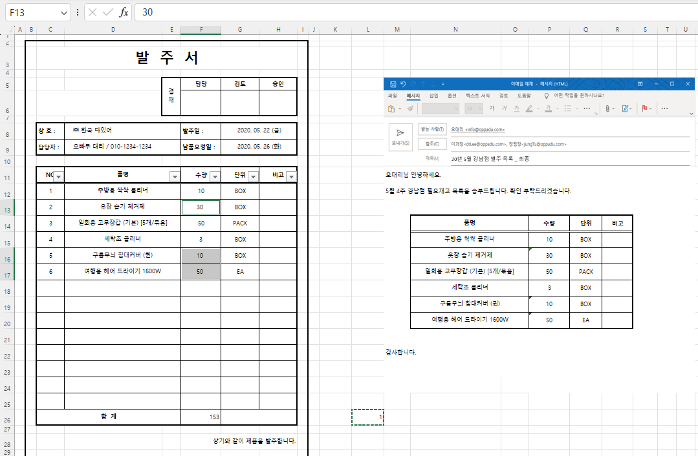
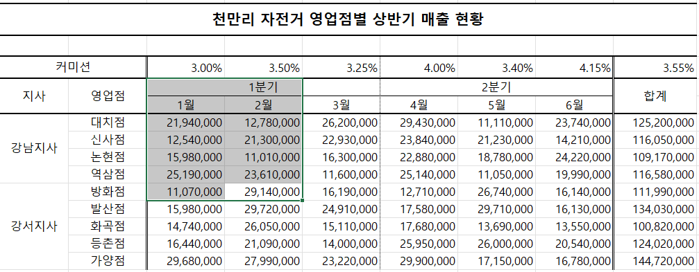
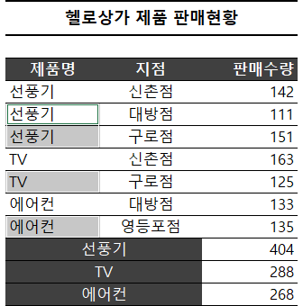
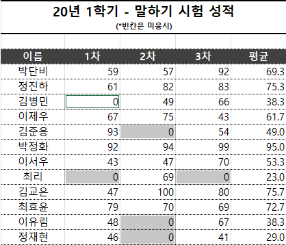
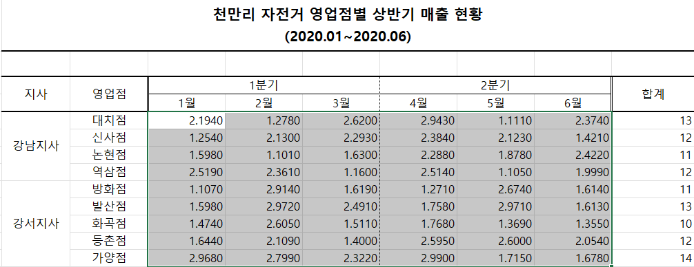
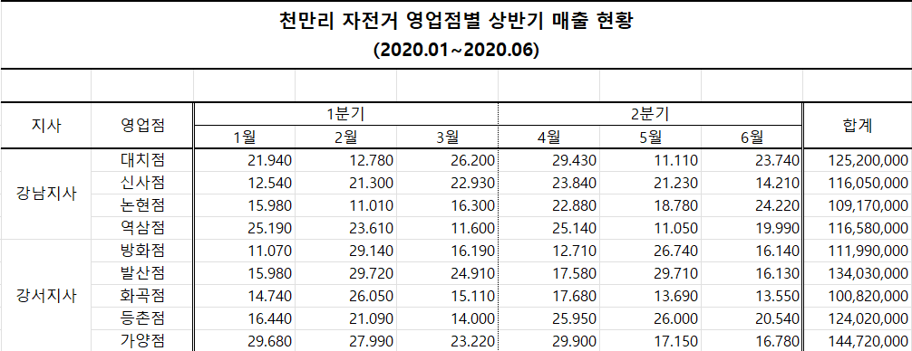
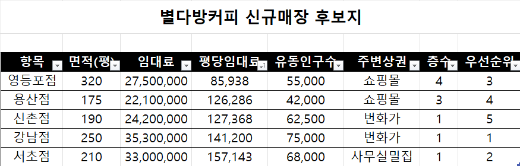
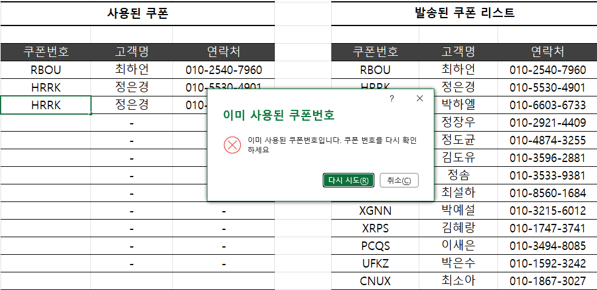
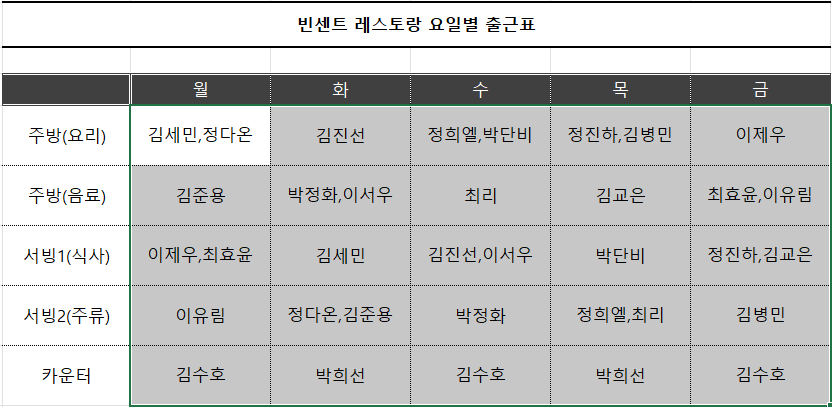

# Excel 1주차 정규 과제 

📌Excel 정규과제는 매주 정해진 분량의 『*진짜 쓰는 실무 엑셀*』 을 읽고 학습하는 것입니다. 이번주는 아래의 **EXCEL_1st_TIL**에 나열된 분량을 읽고 공부하시면 됩니다.

아래의 문제를 풀어보며 학습 내용을 점검하세요. 문제를 해결하는 과정에서 개념을 스스로 정리하고, 필요한 경우 제시된 강의를 참고하여 보완하는 것이 좋습니다.

**교재 실습 예제 파일은 1주차 과제 설명 노션에 있습니다. 해당 파일을 다운 후 실습 진행해주시면 됩니다.**

**👀(수행 인증샷은 필수입니다.)** 

## EXCEL_1st_TIL

### 1장 시작부터 남다른 실무자의 엑셀 활용
#### 01. 엑셀 기본 설정 변경으로 맞춤 환경 만들기 (범위 제외)
#### 02. 엑셀 좀 사용하려면 반드시 알아야 할 엑셀 기본키 (범위 제외)
#### 03. 엑셀의 기본 동작 원리 이해하기
#### 04. 엑셀에서 발생하는 모든 오류와 해결 방법 총정리
#### 05. 실무자면 꼭 알아야 할, 필수 단축키 모음

### 2장 실무자라면 반드시 알아야 할 엑셀 활용
#### 01. 보기 좋은 표, 활용할 수 있는 데이터를 위한 필수 상식
#### 02. 편리한 엑셀 문서 작업을 위한 실력 다지기
#### 03. 엑셀로 시작하는 기초 데이터 분석
#### 02. 엑셀 데이터 가공을 위한 텍스트 나누고 합치기

## Study Schedule

| 주차  | 공부 범위     | 완료 여부 |
| ----- | ------------- | --------- |
| 1주차 | p.22~111    | ✅         |
| 2주차 | p.112~157   | 🍽️         |
| 3주차 | p.158~213  | 🍽️         |
| 4주차 | p.214~273 | 🍽️         |
| 5주차 | p.274~339 | 🍽️         |
| 6주차 | p.340~425 | 🍽️         |
| 7주차 | p.426~472 | 🍽️         |

 

<!-- 여기까진 그대로 둬 주세요-->

---

# 1️⃣ 학습 내용 정리

## 01-3. 엑셀의 기본 동작 원리 이해하기
> **셀 참조 방식에 대해 정리해주세요.**
- $ 기호의 역할: 행이나 열을 고정할 때 $ 기호를 사용, 단축키 `F4`

- 상대 참조 (=A1): $ 기호가 없는 기본 형식으로, 수식을 복사하거나 자동 채우기를 실행하면 이동한 위치에 맞춰 참조 셀 주소도 함께 변함

절대 참조 (=$A$1): 열과 행에 모두 $를 붙인 형식으로, 위치가 바뀌거나 자동 채우기를 해도 참조 셀 주소가 항상 고정

혼합 참조 (=A$1: 행 고정, =$A1: 열 고정): 행이나 열 중 하나만 선택하여 고정

## 01-4. 엑셀에서 발생하는 모든 오류와 해결 방법 총정리
> **숫자처럼 보이는 문자를 빠르게 확인하고 해결하기(51 ~52p)를 진행 후 인증사진을 첨부해주세요.**

## 01-5. 실무자면 꼭 알아야 할, 필수 단축키 모음
> **이번에 배운 단축키에 대해 정리해주세요.**
- 파일 관리 단축키
    - `Ctrl+F11`: 새로운 시트 

- 작업 단축키
    - `Shift+F10`: 팝업 메뉴
    - `Ctrl+F1`: 리본 메뉴 숨기기/표시하기
    - `Ctrl+shift+U`: 수식 입력줄 확장

- 보기 및 필터 단축키
  - `Alt` → `W` → `F` → `F`: 틀 고정 실행
  - `Ctrl+Shift+L`: 자동 필터 적용
  - `Alt+↓`: 필터 옵션 활성화
  - `E`: 필터 검색창 바로 이동

- 선택 단축키
  - `Ctrl+\`: 기준 열과 다른 값 선택 (좌우 비교)
  - `Ctrl+Shift+\`: 기준 행과 다른 값 선택 (상하 비교)
  - `Ctrl+[`: 현재 셀을 계산하는 데 사용된 참조 셀 추적 선택
  - `Ctrl+]`: 현재 셀을 참조하고 있는 셀 추적 선택
  - `Ctrl+A`: 연속된 범위 선택 (한 번 더 누르면 전체 시트 선택)
  - `Ctrl+Space`: 열 전체 선택
  - `Shift+Space`: 행 전체 선택
  - `Alt+;`: 화면에 보이는 셀만 선택 (숨겨진 셀 제외)

- 편집 및 입력 단축키
  - `Alt+Enter`: 셀 안에서 줄 바꿈
  - `Ctrl+Alt+V`: 선택하여 붙여넣기 대화상자 열기
  - `Ctrl+H`: 바꾸기
  - `F4`: 이전 작업 반복
  - `F2`: 활성화된 셀 즉시 편집 모드 전환
  - `Ctrl+Y`: 다시 실행
  - `Ctrl+Enter`: 선택한 모든 셀에 같은 값/수식 한 번에 입력
  - `Ctrl++`: 새로운 행/열/셀 삽입
  - `Ctrl+-`: 선택된 행/열/셀 삭제
  - `Ctrl+D`: 선택 범위의 첫 행 값으로 아래 방향 채우기
  - `Ctrl+R`: 선택 범위의 첫 열 값으로 오른쪽 방향 채우기
  - `Ctrl+E`: 빠른 채우기

- 서식 단축키
  - `Ctrl+1`: 셀 서식 대화상자 열기
  - `Alt` → `H` → `B` → `A`: 전체 테두리 적용
  - `Ctrl+Shift+7`: 바깥쪽 테두리 적용
  - `Ctrl+Shift+~`: 일반 서식 적용
  - `Ctrl+Shift+1`: 천 단위 구분 쉼표 숫자 서식 적용
  - `Ctrl+Shift+2`: 시간 서식 적용
  - `Ctrl+Shift+3`: 날짜 서식 적용
  - `Ctrl+Shift+4`: 통화 서식 적용
  - `Ctrl+Shift+5`: 백분율 서식 적용
  - `Ctrl+Shift+6`: 지수 서식 적용

- **이동 및 탐색 단축키**
  - `Ctrl+방향키`: 데이터가 연속된 범위의 마지막 셀로 이동
  - `Ctrl+Shift+방향키`: 데이터 끝까지 한 번에 범위 선택
  - `Ctrl+Backspace`: 화면 스크롤 중 현재 활성화된 셀 위치로 화면 복귀
  - `Ctrl+Home`: 첫 번째 셀(`A1`)로 이동
  - `Ctrl+End`: 시트에서 사용된 마지막 셀로 이동
  - `F5` 또는 `Ctrl+G`: 이동 대화상자 열기

- **그룹 및 숨기기 단축키**
  - `Alt+Shift+→`: 선택 범위 그룹화
  - `Alt+Shift+←`: 선택 범위 그룹 해제
  - `Ctrl+9`: 행 숨기기
  - `Ctrl+Shift+9`: 행 숨기기 취소
  - `Ctrl+0`: 열 숨기기
  - `Ctrl+Shift+0`: 열 숨기기 취소

## 02-1. 보기 좋은 표, 활용할 수 있는 데이터를 위한 필수 상식
> **데이터와 표를 비교해주세요**
- 데이터:분석과 가공을 위해 열(Field/Column) 단위로 정리된 원시 기록
- 표: 사람이 보기 편리하도록 행과 열을 교차 배치한 요약 양식

> **셀 병합 기능을 자제해야 하는 이유를 정리해주세요.**
1. 범위 선택 및 수정/편집의 제한
2. 표 기능과 피벗 테이블 사용 제한
3. 자동 채우기 및 함수 사용 시 오류 발생
4. 데이터 정렬 기능 사용 불가

## 02-2. 편리한 엑셀 문서 작업을 위한 실력 다지기
> **셀 병합하지 않고 가운데 정렬하(75 ~77p)를 진행 후 인증사진을 첨부해주세요.**

> **셀 병합 해제 후 빈칸 쉽게 체우기(78 ~79p)를 진행 후 인증사진을 첨부해주세요.**

> **빈 셀을 한 번에 찾고 내용 입력하기(80 ~81p)를 진행 후 인증사진을 첨부해주세요.**

> **숫자 데이터의 기본 단위를 한 번에 바꾸는 방법(84 ~87p)를 진행 후 인증사진을 첨부해주세요.**

## 02-3. 엑셀로 시작하는 기초 데이터 분석
> **행/열 전환하여 새로운 관점으로 데이터 살펴보기(88 ~90p)를 진행 후 인증사진을 첨부해주세요.**

> **중복된 데이터 입력 제한하기(90 ~92p)를 진행 후 인증사진을 첨부해주세요.**

## 02-4. 엑셀 데이터 가공을 위한 텍스트 나누고 합치기
> **여러 줄을 한 줄로 합치거나 한 줄을 여러 줄로 분리하기(104 ~107p)를 진행 후 인증사진을 첨부해주세요.**

> **여러 열에 입력된 내용을 간단하게 한 열로 합치기(108 ~109p)를 진행 후 인증사진을 첨부해주세요.**

---

### 🎉 수고하셨습니다.
