# Excel 3주차 정규 과제 

📌Excel 정규과제는 매주 정해진 분량의 『*진짜 쓰는 실무 엑셀*』 을 읽고 학습하는 것입니다. 이번주는 아래의 **EXCEL_3rd_TIL**에 나열된 분량을 읽고 공부하시면 됩니다.

아래의 문제를 풀어보며 학습 내용을 점검하세요. 문제를 해결하는 과정에서 개념을 스스로 정리하고, 필요한 경우 제시된 강의를 참고하여 보완하는 것이 좋습니다.

**교재 실습 예제 파일은 1주차 과제 설명 노션에 있습니다. 해당 파일을 다운 후 실습 진행해주시면 됩니다.**

**👀(수행 인증샷은 필수입니다.)** 

## EXCEL_3rd_TIL

### 4장 완성한 엑셀 보고서 공유 및 출력하기
#### 01. 1분 투자로 100점짜리 보고서 완성하기
#### 02. 외부 통합 문서 참조할 때 발생하는 오류 처리하기
#### 03. 외부 공유를 대비하여 정보를 관리하자 (범위 제외)
#### 04. 엑셀 파일 크기를 절반으로 줄이는 방법 3가지 (범위 제외)
#### 05. 엑셀은 보안 측면에서 완벽한 프로그램이 아니다
#### 06. 실무자가 반드시 알아야 할 인쇄 설정 기본
#### 07. 여러 페이지 보고서를 인쇄할 때 확인 사항
#### 08. 엑셀 문서를 PDF로 변환하는 가장 쉬운 방법 (범위 제외)

## Study Schedule

| 주차  | 공부 범위     | 완료 여부 |
| ----- | ------------- | --------- |
| 1주차 | p.22~111    | ✅         |
| 2주차 | p.112~157   | ✅         |
| 3주차 | p.158~213  | ✅         |
| 4주차 | p.214~273 | 🍽️         |
| 5주차 | p.274~339 | 🍽️         |
| 6주차 | p.340~425 | 🍽️         |
| 7주차 | p.426~472 | 🍽️         |

 

<!-- 여기까진 그대로 둬 주세요-->

---

# 1️⃣ 학습 내용 정리
- 눈금선과 머리글을 숨겨서 더욱 깔끔하게 정리하기
    - 특히, 차트가 포함된 보고서라면 눈금선을 숨김으로서 파워포인트와 비슷한 대시보드 스타일의 보고서 작성 가능.
    - [보기] 탭 → [표시] 그룹에서 [눈금선]과 [머리글] 옵션의 체크 해제
- 한 시트에 데이터가 많다면 틀 고정 기능 사용하기(틀 고정/첫 행 고정/첫 열 고정)
    - 단축키: [Alt]→[W]→[F]→[F]
- 종이에 인쇄할 보고서라면 `페이지 나누기 미리보기` 또는 `페이지 래이아웃`형태로 전달
## 04-1. 1분 투자로 100점짜리 보고서 완성하기
> **입력하는 값 & 계산되는 값 구분하기(162 ~ 163p)를 진행 후 인증사진을 첨부해주세요.**
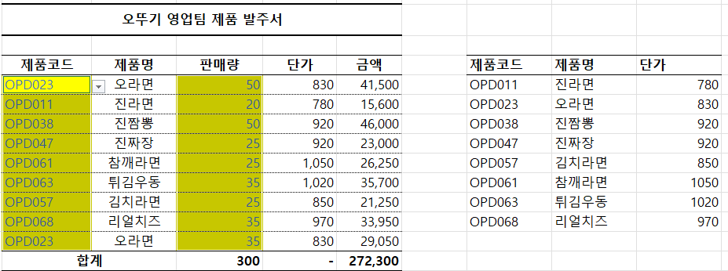

## 04-2. 외부 통합 문서 참조할 때 발생하는 오류 처리하기
- 외부 통합 문서 사용으로 오류가 발생하는 상황
    1. 원본 데이터 파일과 집계 파일이 따로 있고, 집계 파일에서 VLOOKUP 함수나 SUMIF 함수를 사용하여 원본 데이터 파일의 일부를 참조할 때
    2. VLOOKUP 함수나 SUMIF 함수로 다른 시트의 데이터를 참조하는 수식이 포함된 시트를 새로운 통함 문서로 이동/복사하면 새로운 통합 문서에서 기존 통합 문서 즉, 외부 통합 문서를 참조할 때
    - 파일 배포 전에는 외부 파일 연결 여부를 확인해야함
        - [데이터] 탭 → [쿼리 및 연결] 그룹에서 [연결 편집] 확인([연결 편집]이 회색일 시, 외부연결 비활성화 상태)
> **외부 데이터 원본에 대한 연결 오류 해결하기(166 ~167p)를 진행 후 인증사진을 첨부해주세요.**
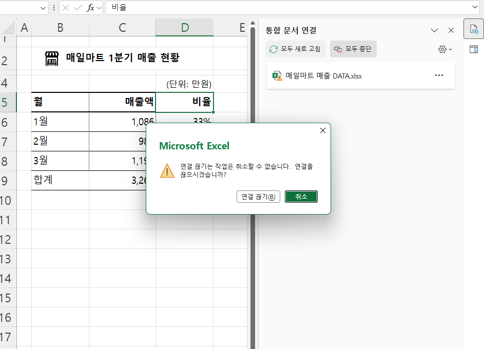

## 04-5. 엑셀은 보안 측면에서 완벽한 프로그램이 아니다
- 데이터 유효성 기능을 사용하면, 지정한 범위에 선택된 값만 입력하거나 숫자 또는 날짜만 입력 가능.
    - [데이터] 탭 → [데이터 도구] 그룹에서 [데이터 유효성 검사] 
> 데이터 유효성 검사의 제한 대상

| 제한 대상 | 설명 |
| :--- | :--- |
| **정수** | 최솟값과 최댓값을 지정하여 정수만 입력할 수 있습니다. |
| **소수점** | 최솟값과 최댓값을 지정하여 소수만 입력할 수 있습니다. |
| **목록** | 원본으로 설정한 목록만 입력할 수 있습니다. 원본은 특정 범위를 지정하거나 쉼표(`,`)로 구분해서 직접 입력해서 설정합니다. 예) `사과,배,포도` |
| **날짜** | 시작 날짜와 끝 날짜를 지정하여 해당 범위의 날짜만 입력할 수 있습니다. |
| **시간** | 시작 시간과 종료 시간을 지정하여 해당 범위의 시간만 입력할 수 있습니다. |
| **텍스트 길이** | 최솟값과 최댓값을 지정하여 정해진 길이의 텍스트를 입력할 수 있습니다. |
| **사용자 지정** | 수식을 입력하여 조건에 만족하는 값만 입력할 수 있습니다. 예를 들어 '가'로 시작하는 텍스트만 입력하려면 다음과 같이 설정합니다. `=LEFT('셀 주소', 1)="가"` |
> **데이터 유효성 검사로 입력할 데이터 제한하기(179 ~183p)를 진행 후 인증사진을 첨부해주세요.**
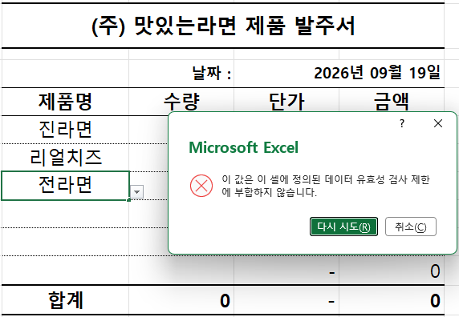
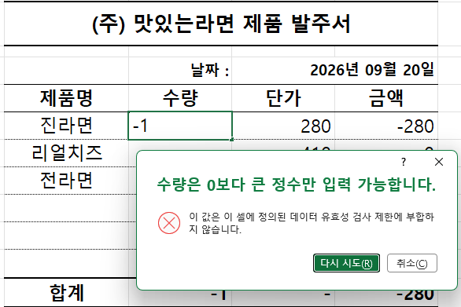
> 메모와 설명 메시지로 보충 설명 추가하기
- 메모: [마우스 우클릭] → [새 메모]
- 설명 메시지: [데이터] 탭 → [데이터 도구] 그룹에서 [데이터 유효성 검사] → [설명 메시지]
> **시트 내용을 수정하지 못하도록 보호하기(186 ~190p)를 진행 후 인증사진을 첨부해주세요.**
- [검토] 탭 → [보호] 그룹에서 [시트 보호]
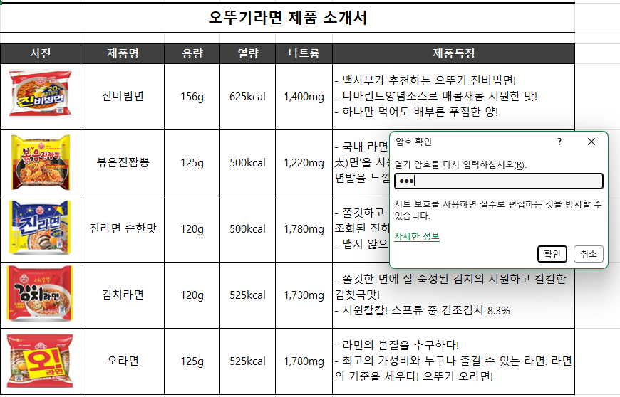
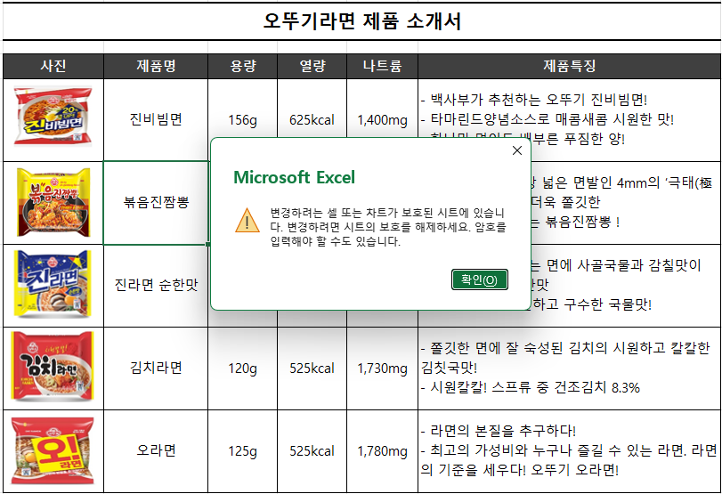

## 04-6. 실무자가 반드시 알아야 할 인쇄 설정 기본
> **해당 내용(194 ~199p)를 진행 후 인증사진을 첨부해주세요.**
- [페이지 레이아웃] 탭 → [페이지 설정] 그룹에서 [인쇄 영역] → [인쇄 영역 설정]
- [보기] 탭 → [통합 문서 보기] 그룹에서 [페이지 나누기 미리 보기]
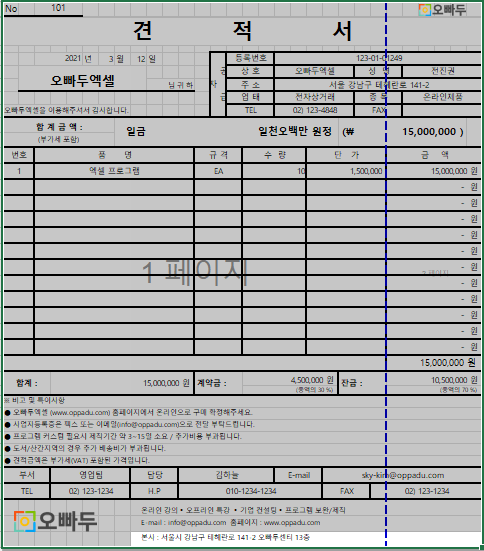
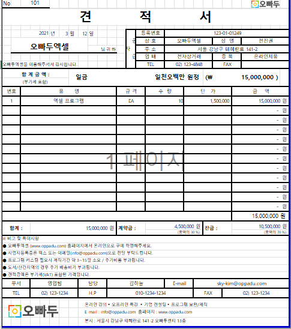

## 04-7. 여러 페이지 보고서를 인쇄할 때 확인 사항
> **해당 내용(200 ~207p)를 진행 후 인증사진을 첨부해주세요.**
- 여러 페이지로 이어진 표라면 제목 행을 반복해서 출력하기
- [페이지 레이아웃] 탭 → [페이지 설정] 그룹에서 [인쇄 제목]
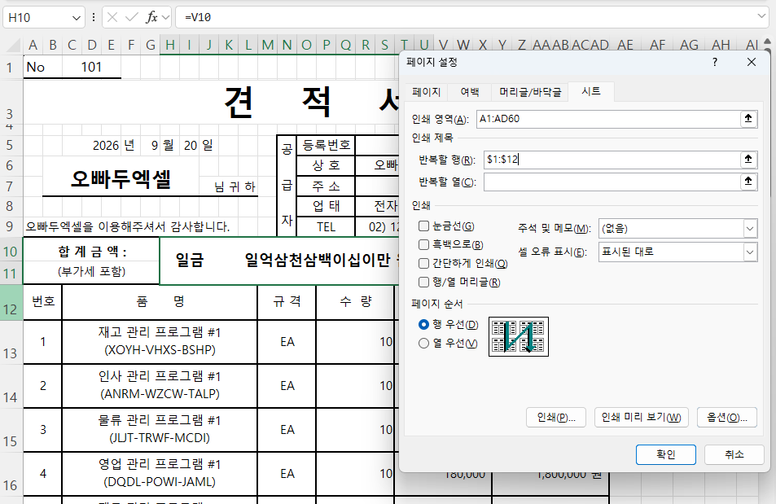
- 머리글/바닥글에 페이지 변호 표시
- [보기] 탭 → [통합 문서 보기] 그룹에서 [페이지 레이아웃]
- 바닥글 편집 상태에서 [페이지 번호]/[페이지 수]
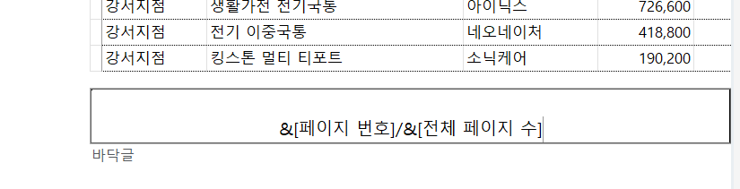
- 머리글/바닥글에 워터마크 추가하기
- [삽입] 탭 → [텍스트] 그룹에서 [머리글/바닥글] → [요소], 엔터키로 위치 조정 + 밝기 ↑ /대비 ↓ 로 투명도 조정
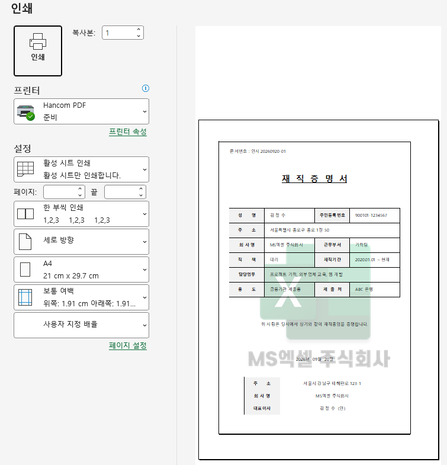
---

### 🎉 수고하셨습니다.

