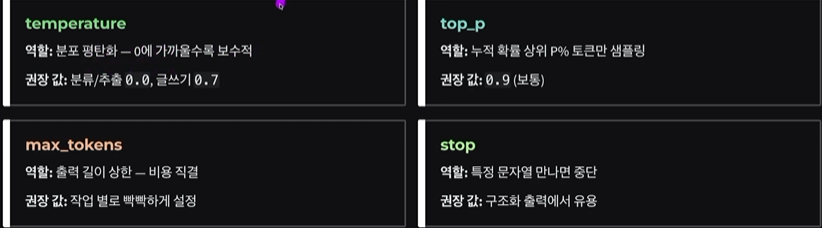

# [이론] 생성형 AI 개론_LLM의 동작 원리, temperature 같은 파라미터의 의미

## 생성형 AI란?
정의: 학습된 분포에서 다음 토큰을 `확률적으로 샘플링`하여 예측하는 모델 
핵심 단위: 토큰 
Context Window: 한번에 처리할 수 있는 최대 길이(Token 총량) 

## Transformer Explainer
- 샘플링 단계 시각화
- 'poloclub.github.io/transformer-explainer/'

토큰 단위로 분류-모델 통과-다음 단어를 확률적으로 예측
- 다음 단어가 확률적으로(무작위로) 나오기 때문에 확률적 다양성 존재, 따라서 실행할 때마다 다른 문장이 출력된다.
- 할루시네이션 위험 노출
- 각각의 토큰들이 임베딩(고차원의 벡터로 변환)
- 다양한 관점에서 토큰의 관계 파악 후 단어 확률적으로 출력
- 최종 출력시 샘플링 기법 이용해서 확률적으로 도출
- Temperature: 확률 분포의 첨도를 결정하는 파라미터, 0에 가깝게 둘수록 더 뾰족한 분포를 가짐 
- Sampling
    - top-k: 확률이 높은 k개 단어 중에서 선택
    - top-p: 상위 p%에 해당하는 단어 중에서 선택

# [이론] LangChain Core / LCEL — init_chat_model 의 의미, LCEL 파이프(|) 문법, Runnable 유형

## init_chat_model - Provider 무관 진입점
- 어떤 모델을 호출하던 동일한 인터페이스 
- Messages: 대화의 기본 단위
    - SystemMessage: 운영자
    - HumanMessage: 사용자
    - AIMessage: 모델의 응답이나 LLM 출력 결과 처리
    - ToolMessage: 외부 세계와 소통하는 인터페이스: tool_call_id와 함께 전달
## LECLL 파이프 연산자로 체인 구성
- 체인 정의 시, 각각 요소들을 |(파이프 연산자)로 구분
    - 첫 번째 요소의 출력이 두 번째 요소의 입력 ...
- StrOutputParcer: 모델의 텍스트 응답만 따로 출력해 주는 파서

## Runnable 컴포넌트
- Langchain만의 유틸리티
    - RunnablePassthrough: 입력을 그대로 전달
    - RunnableLambda: 임의 함수를 Runnable로 래핑: 사용하기 쉽도록 변환
    - RunnableParallel: dict형태로 넘기기
    - RunnableBranch: 조건 분기 처리
    - .with_config(...) run_name, tags, callbacks 주입