# SQL_MASTER 1주차 정규과제

📌SQL MASTER 정규과제는 매주 정해진 분량의 『*데이터 분석을 위한 SQL 레시피*』 를 읽고 학습하는 것입니다. 이번 주는 아래의 **SQL_MASTER_1st_TIL**에 나열된 분량을 읽고 공부하시면 됩니다.

아래 실습을 수행하며 학습 내용을 직접 적용해보세요. 단순히 결과를 재현하는 것이 아니라, SQL을 직접 작성하는 과정에서 개념을 스스로 정리하는 것이 중요합니다.

필요한 경우 교재와 추가 자료를 참고하여 이해를 보완하시기 바랍니다.

## SQL_MASTER_1st_TIL

### 3장 데이터 가공믈 위한 SQL
#### 1. 하나의 값 조작하기
#### 2. 여러 개의 값에 대한 조작
#### 3. 하나의 테이블에 대한 조작
#### 4. 여러 개의 테이블 조작하기


## Study Schedule

| 주차  | 공부 범위     | 완료 여부 |
| ----- | ------------- | --------- |
| 1주차 | p.52~136   | ✅         |
| 2주차 | p.138~184  | 🍽️         |
| 3주차 | p.186~232 | 🍽️         |
| 4주차 | p.233~321 | 🍽️         |
| 5주차 | p.324~406 | 🍽️         |
| 6주차 | p.408~464 | 🍽️         |
| 7주차 | p.466~566 | 🍽️         |

<br>

<!-- 여기까진 그대로 둬 주세요-->


# 실습

## 0. 실습 규칙

1. 샘플 데이터 생성 코드는 **08_SQL_MASTER_Template/src** 경로에 장별로 정리되어 있습니다.
2. 아래 목차에 맞춰 해당 코드를 실행하여 샘플 데이터를 생성한 후, 각 장에서 요구하는 쿼리를 직접 작성해보시기 바랍니다.
3. 작성한 쿼리의 **실행 결과 화면도 함께 제출**해 주세요.
4. 단순히 교재의 예시 코드를 그대로 작성하는 것이 아니라, **제시된 로직을 충분히 이해한 뒤 교재를 보지 않고 스스로 쿼리를 구성**해보는 것을 권장합니다.
5. 교재 예시는 PostgreSQL, Hive, BigQuery 등 다양한 DBMS 기준으로 제시되어 있기 때문에, **MySQL이 아닌 다른 SQL 환경을 사용하여 실습을 진행해도 무방합니다.**
6. 다만, 사용 중인 DBMS에 맞는 문법으로 적절히 변환하여 작성하시기 바랍니다.

## 1. 하나의 값 조작하기 

### 1-1 코드 값을 레이블로 변경하기

- 리포트 작성 시 가독성의 위해 코드 값을 레이블로 변경
- 특정 조건을 기반으로 값을 결정할 때는 **CASE 식**을 사용

    - CASE 식
    ```sql
    CASE
        WHEN <조건식 1> THEN <조건을 만족할 때의 값 1>
        WHEN <조건식 2> THEN <조건을 만족할 때의 값 2>
        WHEN <조건식 3> THEN <조건을 만족할 때의 값 3>
        ELSE <그 외의 값>
        END AS <새_컬럼이름> -- 컬럼명(Alias) 변경
    ```
---

#### 코드를 레이블로 변경
```sql
SELECT
    user_id,
    CASE
        WHEN register_device = 1 THEN '데스크톱'
        WHEN register_device = 2 THEN '스마트폰'
        WHEN register_device = 3 THEN '애플리케이션'
        END AS device_name
FROM `1st_week.mst_users`
ORDER BY user_id ASC;
```

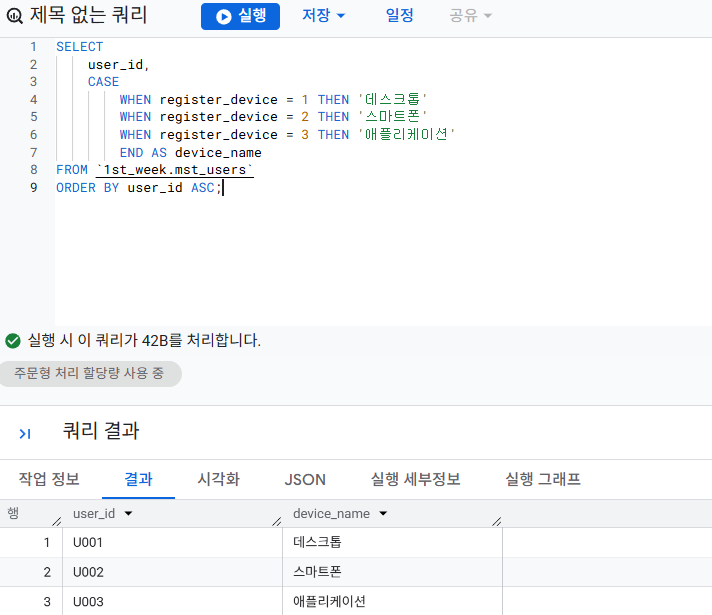

### 1-2 URL에서 요소 추출하기

- 어떤 웹 페이지를 거쳐 넘어왔는지를 판별할 때는 레퍼러(지금 이 페이지에 오기 직전에 머물렀던 이전 페이지의 주소)를 집계
- URL 주소는 가독성이 좋지 않기 떄문에, **특정 값을 추출**하여 사용 

#### 1-2-1 레퍼러로 어떤 웹 페이지를 거쳐 넘어왔는지 판별하기
```sql
-- 레퍼러 도메인을 호스트 단위로 집계
-- 1. REGEXP_EXTRACT 사용
SELECT
    stamp,
    
    -- https:// 또는 http:// 뒤에 오는 첫 번째 슬래시(/) 전까지의 호스트명(도메인)만 괄호 ( )로 묶어 추출
    REGEXP_EXTRACT(referrer, r'https?://([^/]+)') AS referrer_host
FROM `1st_week.access_log`;
-- 2. NET.HOST 사용(Bigquery)
SELECT
    stamp,
    -- URL에서 호스트(도메인) 부분 추출
    NET.HOST(referrer) AS referrer_host
FROM `1st_week.access_log`;
```
```
r'https?://([^/]+)'
│ └──┬─┘ │ └──┬──┘
│    │   │    └─ ③ 괄호 안: 슬래시(/)가 아닌 글자들을 1개 이상 묶어서 '추출'
│    │   └────── ② 문자 그대로 콜론과 슬래시 두 개 (://)
│    └────────── ① http 또는 https 로 시작
└─────────────── (참고: 문자열 앞 'r'은 백슬래시를 있는 그대로 쓰겠다는 의미)
```
- REGEXP_EXTRACT 함수란?
```
1. 형식: REGEXP_EXTRACT(대상_컬럼, r'정규표현식_패턴')
2. 역할: 패턴 내에서 괄호 ( )로 묶은 그룹(Capture Group)에 해당하는 문자열만 추출
3. 일치하는 패턴이 없으면 NULL을 반환함
```
- **상황별 권장 사용 기준**
```
'NET.HOST'를 사용하는 경우
  * Referrer, 접속 URL 로그에서 **순수 도메인/호스트명**만 빠르고 간결하게 뽑아낼 때
  * 포트 번호(`:8080`), 불완전한 URL 구조 등을 내장 파서가 자체 처리해주어 정규식보다 속도가 빠르고 에러 위험이 적음

'REGEXP_EXTRACT'를 사용하는 경우
  * 호스트명 외에 특정 경로 세그먼트(`video/detail`), 쿼리 매개변수 값, 특정 텍스트 패턴 등 '규칙 기반의 유연한 문자열 분리가 필요할 때'
  * 타 데이터베이스(PostgreSQL 등)의 정규식 쿼리를 BigQuery로 이식할 때
```
#### 1-2-2 URL에서 경로와 요청 매개변수 값 추출하기
```sql
-- URL 경로와 GET 매개변수에 있는 특정 키 
-- 1. REGEXP_EXTRACT 사용
SELECT
    stamp,
    url,
    -- 1. URL 경로(Path) 추출 (도메인 뒤부터 ? 또는 # 전까지)
    REGEXP_EXTRACT(url, r'//[^/]+([^?#]+)') AS path,

    -- 2. GET 쿼리 매개변수 중 id의 값 추출
    REGEXP_EXTRACT(url, r'id=([^&]*)') AS id
FROM `1st_week.access_log`;

-- 2. NET 계열 함수 활용
SELECT
    stamp,
    url,
    
    -- 1. 호스트명(도메인) 추출
    NET.HOST(url) AS host,

    -- 2. URL 경로(Path) 추출
    -- 도메인(NET.HOST) 뒤에 붙은 문자열 중 '?' 앞부분까지 잘라내기
    REGEXP_EXTRACT(url, CONCAT('https?://', NET.HOST(url), '([^?#]*)')) AS path,

    -- 3. GET 매개변수 id 값 추출
    REGEXP_EXTRACT(url, r'[?&]id=([^&#]+)') AS id
FROM `1st_week.access_log`; 
```
<p align="center">
  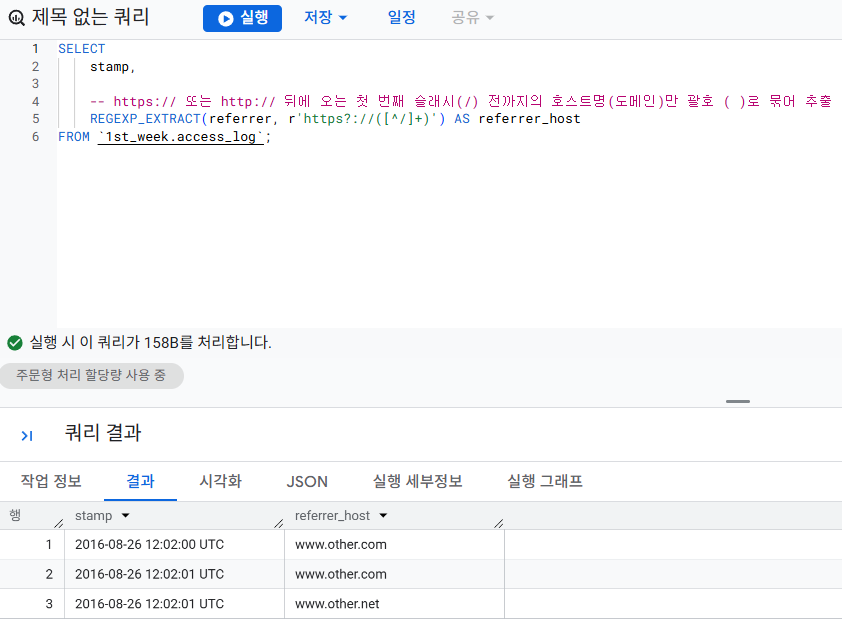
  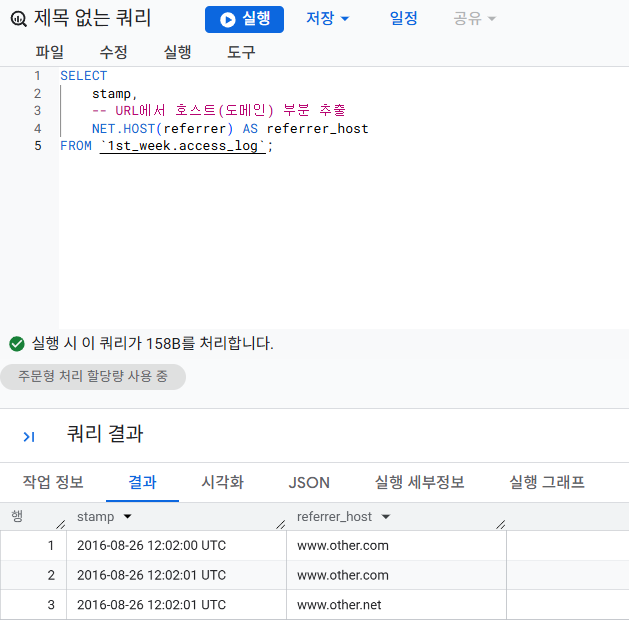
  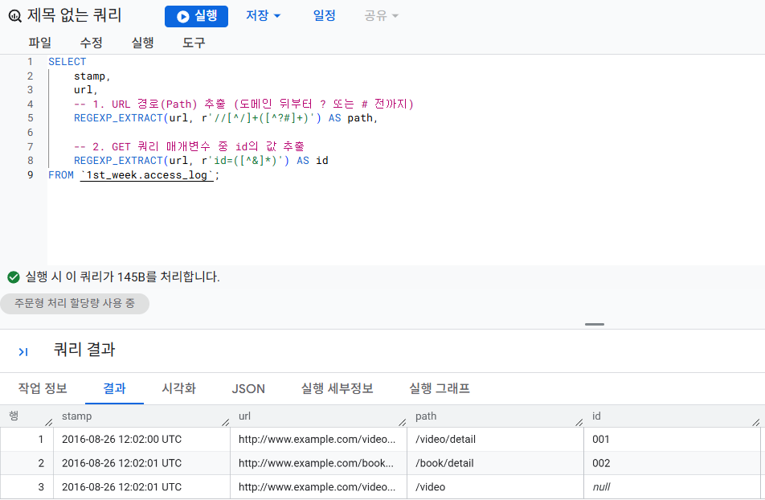
  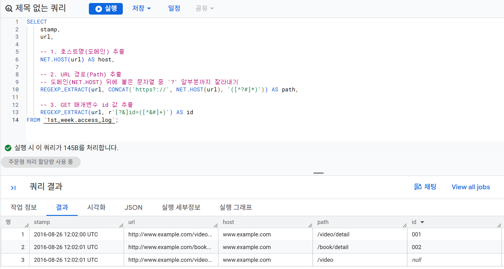
</p>

### 1-3 문자열을 배열로 분해하기

- 문자열 자료형은 더 **세부적으로 분해해서** 사용하는 경우가 많음


```sql
-- URL 경로를 슬래시로 분할해서 계층 추출
SELECT
  stamp,
  url,
  SPLIT(REGEXP_EXTRACT(url, r'//[^/]+([^?#]+)'), '/')[SAFE_ORDINAL(2)] AS path1,
  -- 1) REGEXP_EXTRACT: 도메인 뒤의 세부 경로(Path) 추출
  -- 2) SPLIT: '/' 기준으로 경로를 쪼개어 배열(List)로 반환
  -- 3) [SAFE_ORDINAL()]: n번째 요소 추출 (범위 초과 시 NULL 반환)
  SPLIT(REGEXP_EXTRACT(url, r'//[^/]+([^?#]+)'), '/')[SAFE_ORDINAL(3)] AS path2
FROM `1st_week.access_log`;
```

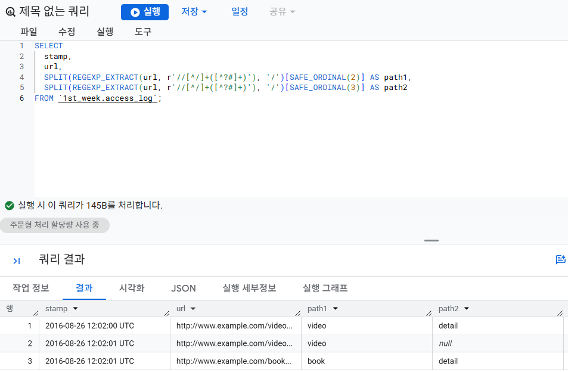

 - SPLIT 함수란?
```
1. 형식: SPLIT(문자열_컬럼, '구분자')
2. 역할: 지정한 구분자(delimiter)를 기준으로 문자열을 잘라 배열(Array) 형태로 반환함
3. 구분자가 포함되어 있지 않으면 원본 문자열 1개만 담긴 배열을 반환함
```

 - SAFE_ORDINAL(n) 인덱싱이란?
```
1. 형식: 배열_컬럼[SAFE_ORDINAL(n)]
2. 역할: 배열의 n번째 요소를 1부터 시작하는 순번 기준으로 추출함
3. 해당 위치(인덱스)에 데이터가 존재하지 않아도 오류(Error)를 내지 않고 안전하게 NULL을 반환함
```

### 1-4 날짜와 타임스탬프 다루기
#### 1-4-1 현재 날짜와 타임스탬프 추출하기

BigQuery는 UTC 시간 리턴 → CURRENT_TIMESTAMP로 리턴되는 시간이 한국 시간과 다름
PostegreSQL에서는 타임존이 적용된 타임스탬프 자료형 리턴


```sql
-- 현재 날짜와 타임스탬프 추출
SELECT
    CURRENT_DATE as dt,
    CURRENT_TIMESTAMP as STAMP
;
```
<figure>
  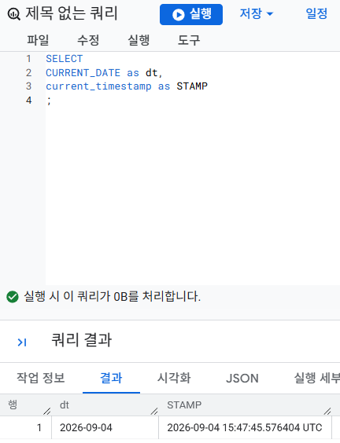
  <figcaption><em>▲ BigQuery 실행 결과 화면: UTC 시간을 리턴한다.</em></figcaption>
</figure>

#### 1-4-2 지정한 값의 날짜/시각 데이터 추출하기

**CAST 함수를 사용하는 방법이 가장 범용적**

- CAST 함수란?: 데이터 타입 변환하는 함수
```
1. 형식: CAST(표현식 AS 목표_데이터타입)
2. 역할: 특정 컬럼이나 값의 데이터 타입을 다른 타입(INT64, STRING, DATE 등)으로 명시적 변환함
3. 변환이 불가능한 형태일 경우 쿼리 실행 에러가 발생함 (오류 대신 NULL을 원하면 SAFE_CAST 사용)
```

```sql
-- 문자열을 날짜/타임스탬프로 변환하기
 1. 명시적 형변환 (`CAST`)
 SELECT
  CAST ('2026-09-04' AS date) AS dt,
  CAST ('2026-09-04 15:47:45' AS timestamp) AS stamp
;
 2. 타입 생성자 함수 (`DATE()`, `TIMESTAMP()`)
 SELECT
  DATE('2026-09-04')AS dt,
  timestamp('2026-09-04 15:47:45') AS stamp
;
 3. 리터럴 표기법 (`DATE '...'`, `TIMESTAMP '...'`)
 SELECT
  DATE '2026-09-04'AS dt,
  timestamp '2026-09-04 15:47:45' AS stamp
;
```

<p align="center">
  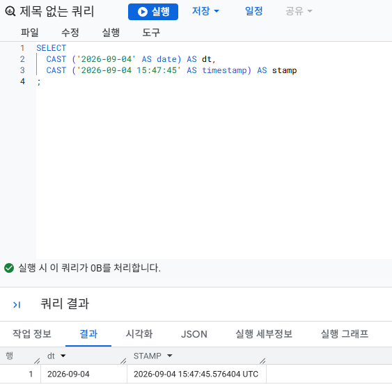
  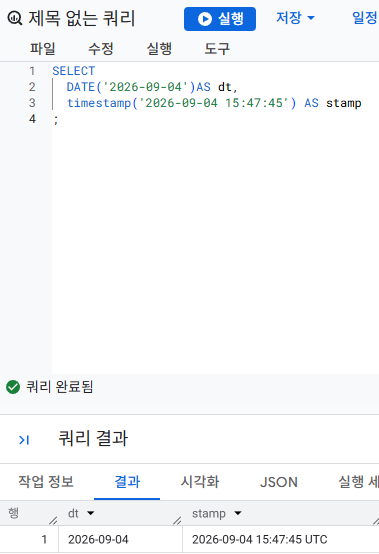
  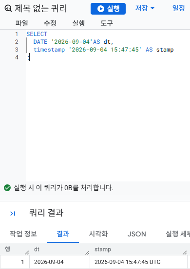
</p>

📌 BigQuery 날짜·시간 타입 변환/생성 방식 3종 비교

| 구분 | 1. 명시적 형변환 (`CAST`) | 2. 타입 생성자 함수 (`DATE()`, `TIMESTAMP()`) | 3. 리터럴 표기법 (`DATE '...'`, `TIMESTAMP '...'`) |
| :--- | :--- | :--- | :--- |
| **작성 예시** | `CAST('2026-09-04' AS DATE)` | `DATE('2026-09-04')` | `DATE '2026-09-04'` |
| **문법 분류** | 표준 명시적 형변환 연산자 | 전용 데이터 생성/변환 내장 함수 | 데이터 타입 리터럴(고정 상수 표기법) |
| **적용 대상** | 모든 컬럼, 변수, 계산식 | 문자열 리터럴, 컬럼, 타임스탬프 객체 | **순수 고정 문자열 상수만 가능** |
| **추가 매개변수** | 불가 | **타임존(`time_zone`) 지정 가능** | 불가 |
| **변환 실패 시** | 쿼리 실행 에러 (대안: `SAFE_CAST` 사용 시 `NULL`) | 쿼리 실행 에러 | 쿼리 파싱(컴파일) 단계에서 에러 |
| **주요 활용 상황** | 테이블 내 기존 컬럼의 데이터 타입을 변경할 때 | 타임존을 반영해 변환하거나 다른 시간 타입끼리 맞출 때 | `WHERE` 조건절 등에서 특정 기준일을 상수로 비교/필터링할 때 |

```
💡 한 줄 요약 및 사용 가이드
*`CAST`: 표준 ANSI SQL 방식으로, **컬럼 데이터의 자료형을 변환**할 때 기본으로 사용합니다.
* 생성자 함수: 시차(`Asia/Seoul` 등)를 고려해 **타임존 기반 날짜/시간을 뽑아내야 할 때** 주로 사용합니다.
* 리터럴 표기: 함수 연산 오버헤드 없이 **고정된 기준 일자/시간을 직관적으로 필터링**할 때 가장 깔끔합니다.
```

#### 1-4-3 날짜/시각에서 특정 필드 추출하기
**EXTRACT 함수 사용**

 - EXTRACT 함수란?
```
1. 형식: EXTRACT(추출할_부분 FROM 대상_컬럼)
2. 역할: DATE, DATETIME, TIMESTAMP 등의 날짜/시간 데이터에서 원하는 특정 요소(연, 월, 일, 요일, 시간 등)만 숫자로 추출함
3. 대상 값이 NULL이면 NULL을 반환함
```
```sql
-- 타임스탬프 자료형의 데이터에서 연, 월, 일 등을 추출하는 쿼리
SELECT
  stamp,
  EXTRACT(YEAR FROM stamp)  AS year,
  EXTRACT(MONTH FROM stamp) AS month,
  EXTRACT(DAY FROM stamp)   AS day,
  EXTRACT(HOUR FROM stamp)  AS hour
FROM (
  SELECT CAST('2026-09-04 12:00:00' AS TIMESTAMP) AS stamp -- SELECT TIMESTAMP '2016-01-30 12:00:00' AS stamp 로도 가능
) AS t
;
```
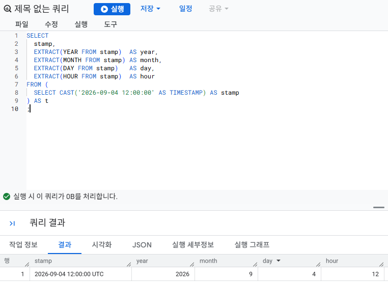

**SUBSTRING(SUBSTR) 함수 사용**
 - SUBSTRING(SUBSTR)란?
```
1. 형식: SUBSTR(문자열_컬럼, 시작_위치, [추출할_길이])
2. 역할: 문자열의 특정 시작 위치부터 지정한 글자 수(길이)만큼 잘라내어 반환함 (시작 위치는 1부터 카운트)
3. 길이를 생략하면 시작 위치부터 문자열 끝까지 추출하며, 위치가 문자열 범위를 벗어나면 빈 문자열('') 또는 NULL을 반환함
```
 ```sql
SELECT
  stamp,
  SUBSTR(stamp, 1, 4)  AS year,
  SUBSTR(stamp, 6, 2)  AS month,
  SUBSTR(stamp, 9, 2)  AS day,
  SUBSTR(stamp, 12, 2) AS hour,
  SUBSTR(stamp, 1, 7)  AS year_month
FROM (
  SELECT CAST('2026-09-04 12:00:00' AS STRING) AS stamp --문자열 자료형인 string 사용
    -- 작은따옴표로 감싼 값 자체가 BigQuery에서는 기본 STRING 타입이므로 SELECT '2016-01-30 12:00:00' AS stamp 로도 가능
) AS t
;
 ```

 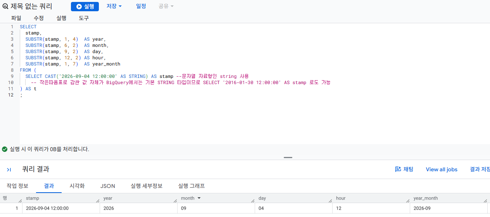

#### 1-4-4 보충
- DATE, DATETIME, TIME, TIMESTAMP
    - DATE: 2002-03-10 (DATE 만 표시하는 데이터)
    - DATETIME: 2002-03-10 16:00:00 (DATE와 TIME까지 표시하는 데이터, Time Zone 정보 없음)
    - TIME: 23:59:59.00 (날짜와 무관하게 시간만 표시하는 데이터)
    - TIMESTAMP: 2023-12-31 14:00:00 UTC (UTC부터 경과한 시간을 나타내는 값, Time Zone 정보 있음)

```
timestamp: 주로 UTC 기준으로 시간 데이터를 저장하고, 데이터베이스 서버의 시간대에 따라 값을 자동으로 변환해줘요. 따라서 시간대 차이가 있는 환경에서 사용할 때 유리하고, 특히 로그 데이터나 시스템 관련 데이터를 다룰 때 유용해요. 다만, 일반적으로 1970년 1월 1일 이후의 시간을 기록할 수 있는 범위가 있어요(2038년까지).

datetime: 특정 시간대에 상관없이 그 자체로 시간을 기록하고, 시간대에 의한 자동 변환이 없어요. 특정 시간대를 고정해놓고 데이터에 사용해야 하는 경우에 유리해요. 예를 들어, 과거 이벤트나 로컬 시간대 기반의 일정을 기록하는 경우 적합해요.

요약
timestamp는 시간대 변환이 필요하거나 서버의 시간이 변동될 가능성이 있는 경우 적합해요.
datetime은 특정 시간대와 무관하게 고정된 시간 정보를 저장하고 싶을 때 좋아요.
```

### 1-5 결손 값을 디폴트 값으로 대치하기

문자열 또는 숫자를 다룰 때는 **중간에 NULL이 들어있는 경우를 주의**

```sql
-- 구매액에서 할인 쿠폰 값을 제외한 매출 금액을 구하는 쿼리
SELECT
  purchase_id,
  amount,
  coupon,
  amount - coupon AS discount_amount1,
  amount - COALESCE(coupon, 0) AS discount_amount2
FROM `1st_week.purchase_log_with_coupon`
ORDER BY purchase_id ASC
;
```

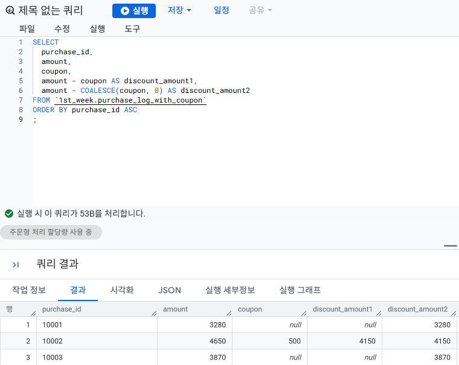

- COALESCE 함수란?
```
1. 형식: COALESCE(값1, 값2, 값3, ...)
2. 역할: 나열된 인자들을 왼쪽부터 순서대로 확인하여, '처음으로 NULL이 아닌 값'을 찾아 반환함
3. 모든 인자가 NULL이면 NULL을 반환함 (주로 NULL 값을 0이나 기본값으로 대체할 때 필수 사용)
```


## 2. 여러 개의 값에 대한 조작 

### 2-1 문자열을 연결하기

앞에서 REGEXP_EXTRACT 함수로 특정 값을 추출했다면 CONCAT 함수로는 단일 값으로 반환

```SQL
SELECT
  user_id,
  CONCAT(pref_name, city_name) AS pref_city  -- CONCAT을 사용해 도/시(pref_name)와 시/군/구(city_name) 문자열을 연결
FROM `1st_week.mst_user_location`
ORDER BY user_id ASC;
```

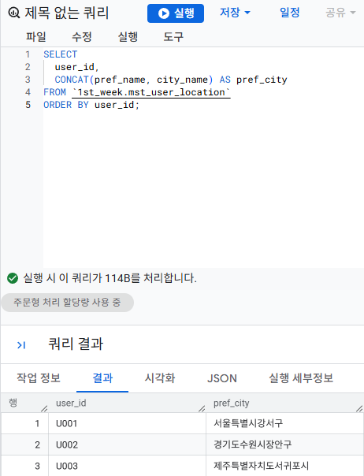

### 2-2 여러 개의 값을 비교하기
#### 2-2-1 분기별 매출 증감 판정하기

**CASE 함수**를 이용하여 조건을 기술하고 조건에 맞는 값을 지정하거나, **SIGN 함수**를 이용하여 간단하게 증감 판정.

- SIGN 함수란?
```
1. 형식: SIGN(계산식)
2. 역할: 숫자의 부호(양수, 0, 음수)를 판별하여 각각 1, 0, -1 중 하나를 반환함
3. 입력값이 양수면 1, 0이면 0, 음수면 -1을 반환하며, NULL이면 NULL을 반환함
```

```SQL
SELECT
  year,
  q1,
  q2,
  CASE
    WHEN q1 < q2 THEN '+'
    WHEN q1 = q2 THEN ' '
    ELSE '-'
  END AS judge_q1_q2,  -- 1) CASE 문으로 Q1과 Q2의 매출 증감 여부를 기호(+, ' ', -)로 평가
  q2 - q1 AS diff_q2_q1, -- 2) Q2와 Q1의 매출 차이 계산
  SIGN(q2 - q1) AS sign_q2_q1 -- 3) SIGN 함수로 부호 판별 (증가: 1, 유지: 0, 감소: -1)
FROM `1st_week.quarterly_sales`
ORDER BY year;
```
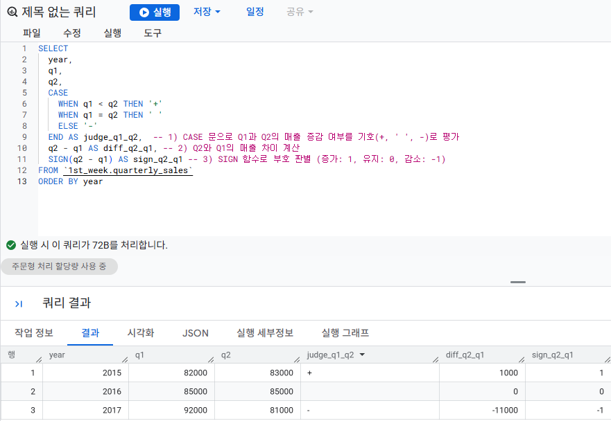

#### 2-2-2 연간 최대/최소 4분기 매출 맞기

컬럼 값에서 최댓값 또는 최솟값을 찾을 때는 **GREATEST 함수** 또는 **LEAST 함수**를 사용

- GREATEST/LEAST 함수란?
```
1. 형식: GREATEST(LEAST)(값1, 값2, 값3, ...)
2. 역할: 나열된 여러 인자(컬럼 또는 값) 중 '최댓값(최솟값)'을 반환함
3. 인자 중 하나라도 NULL이 포함되어 있으면 NULL을 반환함
```

```SQL
SELECT
  year,
  -- NULL을 0으로 치환하여 존재하는 분기 중 최대 매출 계산
  GREATEST(
    COALESCE(q1, 0),
    COALESCE(q2, 0),
    COALESCE(q3, 0),
    COALESCE(q4, 0)
  ) AS greatest_sales,

  -- 최솟값은 0으로 치환 시 왜곡되므로 유효한 값만 골라내거나 기본 LEAST 적용
  LEAST(
    COALESCE(q1, 999999999),
    COALESCE(q2, 999999999),
    COALESCE(q3, 999999999),
    COALESCE(q4, 999999999)
  ) AS least_sales
FROM `1st_week.quarterly_sales`
ORDER BY year;
```

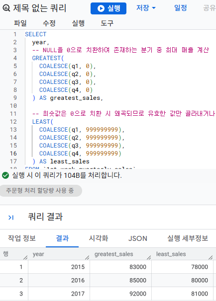

``` SQL
--보충: CONCAT 함수 활용하여 매출액(분기)' 형태 문자열 생성
SELECT
  year,
  -- 1) 순수 최댓값 숫자 구하기
  GREATEST(COALESCE(q1, 0), COALESCE(q2, 0), COALESCE(q3, 0), COALESCE(q4, 0)) AS greatest_sales,

  -- 2) CONCAT으로 '매출액(분기)' 형태 문자열 만들기
  CONCAT(
    CAST(GREATEST(COALESCE(q1, 0), COALESCE(q2, 0), COALESCE(q3, 0), COALESCE(q4, 0)) AS STRING),
    CASE GREATEST(COALESCE(q1, 0), COALESCE(q2, 0), COALESCE(q3, 0), COALESCE(q4, 0))
      WHEN q1 THEN '(Q1)'
      WHEN q2 THEN '(Q2)'
      WHEN q3 THEN '(Q3)'
      WHEN q4 THEN '(Q4)'
    END
  ) AS max_sales_with_quarter
FROM `1st_week.quarterly_sales`
ORDER BY year;
```
#### 2-2-3 연간 평균 4분기 매출 
```SQL
-- 단순 연산
SELECT
  year,
  (q1 + q2 + q3 + q4) / 4 AS average
FROM `1st_week.quarterly_sales`
ORDER BY year;
```
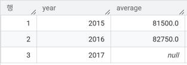<br>
⚠️ NULL 값이 있으므로 사칙연산이 제대로 작동하지 않음
```SQL
-- COALESCE를 사용해 NULL을 0으로변환
SELECT
  year,
  (COALESCE(q1, 0) + COALESCE(q2, 0) + COALESCE(q3, 0) + COALESCE(q4, 0)) / 4 AS average
FROM `1st_week.quarterly_sales`
ORDER BY year;
```

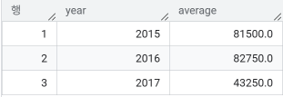<br>
⚠️ 분자가 0이므로 2017년의 평균이 낮아짐
```SQL
-- NULL이 아닌 컬럼만을 사용
SELECT
  year,
  (COALESCE(q1, 0) + COALESCE(q2, 0) + COALESCE(q3, 0) + COALESCE(q4, 0))
  / (
      SIGN(COALESCE(q1, 0)) + SIGN(COALESCE(q2, 0))
    + SIGN(COALESCE(q3, 0)) + SIGN(COALESCE(q4, 0)) -- NULL이 아닌 유효한 분기 개수의 합으로 나누기
  ) AS average
FROM `1st_week.quarterly_sales`
ORDER BY year;
```
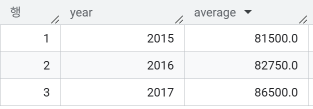


### 2-3 2개의 값 비율 계산하기
#### 2-3-1 정수 자료형의 데이터 나누기
하나의 레코드에 포함된 값을 난루 때는 SELECT 구문 내부에서 '/'를 사용<br>
결과를 퍼센트로 나타낼 때는 ctr 컬럼의 결과에 100을 곱함.
```sql
-- 정수 자료형의 데이터를 나누는 쿼리
SELECT
  dt,
  ad_id,
  clicks / impressions AS ctr,
  100.0 * clicks / impressions AS ctr_as_percent
FROM `1st_week.advertising_stats`
WHERE dt = '2017-04-01'
ORDER BY
  dt,
  ad_id;
```
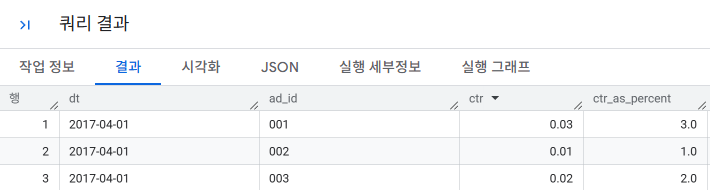
#### 2-3-2 0으로 나누는 것 피하기
0으로 나눌 시 **오류 발생**<br>
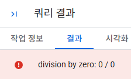

- 해결법
CASE 식을 사용해 **분모가 0인 경우와 0이 아닌 경우로 분리**<br>
```sql
-- 0으로 나누는 것을 피해 CTR을 계산하는 쿼리 1
SELECT
  dt,
  ad_id,
  CASE
    WHEN impressions > 0 THEN 100.0 * clicks / impressions
  END AS ctr_as_percent_by_case
FROM `1st_week.advertising_stats`
ORDER BY
  dt,
  ad_id;
```
**NULLIF 함수**를 이용해 0을 NULL로 변환
```sql
-- 0으로 나누는 것을 피해 CTR을 계산하는 쿼리 2
SELECT
  dt,
  ad_id,
  100.0 * clicks / NULLIF(impressions, 0) AS ctr_as_percent_by_null
FROM `1st_week.advertising_stats`
ORDER BY
  dt,
  ad_id;
```
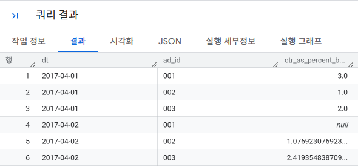

- NULL을 다루는 함수<br>

| 함수 | 문법 | 역할 | 동작 원리 |
| :--- | :--- | :--- | :--- | 
| **`NULLIF`** | `NULLIF(A, B)` | **NULL 생성** (0 나누기 방지 등) | `A = B`이면 `NULL`, 다르면 `A` 반환 |
| **`IFNULL`** | `IFNULL(A, B)` | **NULL 대체** (단순 2개 비교) | `A`가 `NULL`이면 `B`, 아니면 `A` 반환 |
| **`IF`** | `IF(expr1,expr2,expr3)` | IF() 함수는 NULL이 하나만 있을 경우, NULL이 아닌 쪽의 타입을 따른다. | expr1이 참이면 expr2를 반환, 거짓이면 expr3을 반환 |
| **`COALESCE`** | `COALESCE(A, B, C, ...)` | **NULL 대체** (다중 우선순위) | 나열된 인자 중 첫 번째로 `NULL`이 아닌 값 반환 |
| **`NVL`** | `NVL(A, B)` | `IFNULL`의 Oracle 전용 별칭 | `A`가 `NULL`이면 `B`, 아니면 `A` 반환 |
| **`NVL2`** | `NVL2(A, B, C)` | 삼항 연산 대체 (Oracle 전용) | `A`가 `NULL`이 아니면 `B`, `NULL`이면 `C` 반환 |

### 2-4 두 값의 거리 계산하기
#### 2-4-1 숫자 데이터의 절댓값, 제곱 평균 제곱근(RMS) 계산하기
- 절댓값 계산 시: ABS 함수 사용
- 제곱 계산 시: POWER 함수 사용
- 제곱근 계산 시: SQRT 함수 

| 연산 | 함수 문법 |
| :--- | :--- |
| **절댓값** | `ABS(X)` |
| **제곱 (거듭제곱)** | `POWER(X, Y)` |
| **제곱근 (루트)** | `SQRT(X)` |
```sql
-- 일차원 데이터의 절댓값과 제곱 평균 제곱근을 계산하는 쿼리
SELECT
  ABS(x1 - x2) AS abs,
  SQRT(POWER(x1 - x2, 2)) AS rms
FROM `1st_week.location_1d`;
```
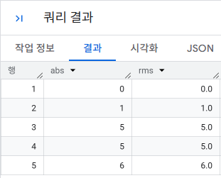
#### 2-4-2 xy 평면 위에 있는 두 점의 유클리드 거리 계산하기

제곱 평균 제곱근을 사용해 유클리드 거리 계산
* PostgreSQL에는 POINT 자료형이라고 불리는 좌표를 불리는 자료 구조 존재. 거리 연산자 <-> 사용

```sql
-- 이차원 테이블에 대해 제곱 평균 제곱근(유클리드 거리)을 구하는 쿼리
SELECT
  SQRT(POWER(x1 - x2, 2) + POWER(y1 - y2, 2)) AS dist
FROM `1st_week.location_2d`;
```

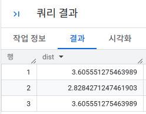

### 2-5 날짜/시간을 계산하기
나이는 시간에 따라서 변화, 일반적으로 생년월일을 저장하고, 이후에 계산해서 나이를 구하게 됨<br>
실무에서 날짜 /시간 데이터는 수치 또는 문자열 등으로 변환해 다루는 것이 편한 경우도 있음
```
한국 나이 구하기
- 연 단뒤 부분 추출 - 현재 연도 +1 
```
#### 2-5-1 날짜 데이터들의 차이 계산하기
```sql
-- 미래 또는 과거의 날짜/시간을 계산하는 쿼리
SELECT
  user_id,
  TIMESTAMP(register_stamp) AS register_stamp, -- 1. 문자열을 TIMESTAMP로 파싱
  TIMESTAMP_ADD(TIMESTAMP(register_stamp), INTERVAL 1 HOUR) AS after_1_hour, -- 2. 1시간 뒤 (TIMESTAMP_ADD 사용)
  TIMESTAMP_SUB(TIMESTAMP(register_stamp), INTERVAL 30 MINUTE) AS before_30_minutes, -- 3. 30분 전 (TIMESTAMP_SUB 사용)
  DATE(TIMESTAMP(register_stamp)) AS register_date, -- 4. 문자열 타임스탬프를 DATE(날짜) 형태로 변환
  DATE_ADD(DATE(TIMESTAMP(register_stamp)), INTERVAL 1 DAY) AS after_1_day, -- 5. 1일 뒤 (DATE_ADD 사용)
  DATE_SUB(DATE(TIMESTAMP(register_stamp)), INTERVAL 1 MONTH) AS before_1_month -- 6. 1개월 전 (DATE_SUB 사용)
FROM `1st_week.mst_users_with_dates`
ORDER BY user_id;
```
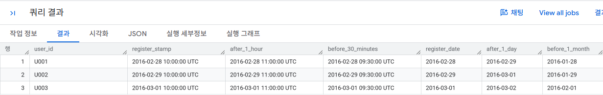
```sql
-- 두 날짜의 차이를 계산하는 쿼리
SELECT
  user_id,
  CURRENT_DATE() AS today, -- 1. 현재 날짜 조회
  DATE(TIMESTAMP(register_stamp)) AS register_date, -- 2. 문자열 타임스탬프를 DATE(날짜)형으로 변환
  DATE_DIFF(CURRENT_DATE(), DATE(TIMESTAMP(register_stamp)), DAY) AS diff_days -- 3. BigQuery 전용 DATE_DIFF 함수로 두 날짜 간의 일수 차이 계산
FROM `1st_week.mst_users_with_dates`
ORDER BY user_id;
```


#### 2-5-2 사용자의 생년월일로 나이 계산하기
나이는 시간에 따라서 변화하므로, 일반적으로 생년월일을 저장하고, 이후에 계산해서 나이를 구하게 됨<br>
전용 함수를 사용하지 않고 나이를 계산하려면, 날짜를 고정 자리 수의 **정수**로 표현하고, 그 차이를 계산.
```sql
-- 날짜를 정수로 표현하여 나이를 계산하는 함수
SELECT floor((20260904-20020310)/10000) AS age;
```
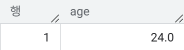

```sql
-- 등록 시점과 현재 시점의 나이를 문자열로 계산하는 쿼리 
SELECT
  user_id,
  SUBSTR(register_stamp, 1, 10) AS register_date, -- 1. 가입 타임스탬프에서 날짜 부분(10자리) 추출
  birth_date,

  -- 2. 등록 시점의 만 나이 계산
  FLOOR(
    (
      CAST(REPLACE(SUBSTR(register_stamp, 1, 10), '-', '') AS INT64)
      - CAST(REPLACE(birth_date, '-', '') AS INT64)
    ) / 10000
  ) AS register_age,

  -- 3. 현재 시점의 만 나이 계산
  FLOOR(
    (
      CAST(REPLACE(CAST(CURRENT_DATE() AS STRING), '-', '') AS INT64)
      - CAST(REPLACE(birth_date, '-', '') AS INT64)
    ) / 10000
  ) AS current_age
FROM `1st_week.mst_users_with_dates`
ORDER BY user_id;
```
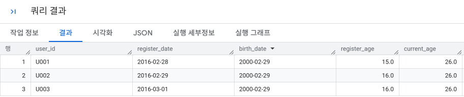

#### 2-5-3 date_diff함수를 이용해서 연 부분 차이를 계산
```sql
-- date_diff함수를 이용해서 연 부분 차이를 계산하는 쿼리(BigQuery)
SELECT
  user_id,
  CURRENT_DATE() AS today, -- 1. 현재 날짜 반환
  DATE(TIMESTAMP(register_stamp)) AS register_date, -- 2. 가입 타임스탬프를 DATE형으로 변환
  DATE(TIMESTAMP(birth_date)) AS birth_date, -- 3. 생년월일 문자열을 DATE형으로 변환
  DATE_DIFF(CURRENT_DATE(), DATE(TIMESTAMP(birth_date)), YEAR) AS current_age, -- 4. 현재 날짜 기준 단순 연도 차이(연 나이) 계산
  DATE_DIFF(DATE(TIMESTAMP(register_stamp)), DATE(TIMESTAMP(birth_date)), YEAR) AS register_age -- 5. 가입일 기준 단순 연도 차이 계산
FROM `1st_week.mst_users_with_dates`
ORDER BY user_id;
```
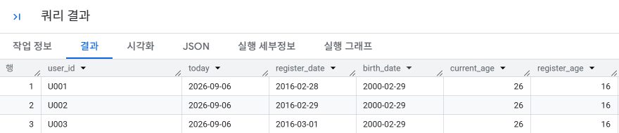

#### 2-5-4 floor 함수
FLOOR(숫자)는 즉 소수점을 무조건 버림하는 수학 함수

### 2-6 IP 주소 다루기

보통 IP 주소를 로그로 저장할 때는 문자열로 저장

#### 2-6-1 IP 주소 자료형 활용하기
```PostgreSQL
-- inet 자료형을 사용한 IP 주소 비교 쿼리
SELECT
  CAST('123.0.0.1'AS inet) < CAST('123.0.0.2'AS inet) AS lt
  CAST('123.0.0.1'AS inet) > CAST('154.0.0.1'AS inet) AS gt

-- address/y 형식의 네트워크 범위에 IP 주소가 포함되는지 판정: << 또는 >> 연산자 사용
SELECT CAST ('127.0.0.1' AS inet) << CAST ('127.0.0.0/8'AS inet) AS is_contained
```

#### 2-6-2 정수 또는 문자열로 IP 주소 다루기
```sql
--  IP 주소에서 4개의 10진수 부분을 추출하는 쿼리
SELECT --'.'을 기준으로 분해
  ip,
  CAST(SPLIT(ip, '.')[SAFE_ORDINAL(1)] AS INT64) AS ip_part_1, -- 1. 첫 번째 옥텟(10진수) 추출 후 정수형 변환
  CAST(SPLIT(ip, '.')[SAFE_ORDINAL(2)] AS INT64) AS ip_part_2, -- 2. 두 번째 옥텟 추출 후 정수형 변환
  CAST(SPLIT(ip, '.')[SAFE_ORDINAL(3)] AS INT64) AS ip_part_3, -- 3. 세 번째 옥텟 추출 후 정수형 변환
  CAST(SPLIT(ip, '.')[SAFE_ORDINAL(4)] AS INT64) AS ip_part_4  -- 4. 네 번째 옥텟 추출 후 정수형 변환
FROM
  (SELECT '192.168.0.1' AS ip) AS t;
```
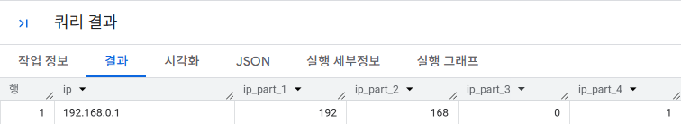
```sql
-- IP 주소를 정수 자료형 표기로 변환하는 쿼리
SELECT
  ip,
  (
    CAST(SPLIT(ip, '.')[SAFE_ORDINAL(1)] AS INT64) * POW(2, 24) -- 1번째 옥텟을 24비트 이동
    + CAST(SPLIT(ip, '.')[SAFE_ORDINAL(2)] AS INT64) * POW(2, 16) -- 2번째 옥텟을 16비트 이동
    + CAST(SPLIT(ip, '.')[SAFE_ORDINAL(3)] AS INT64) * POW(2, 8) -- 3번째 옥텟을 8비트 이동
    + CAST(SPLIT(ip, '.')[SAFE_ORDINAL(4)] AS INT64) * POW(2, 0) -- 4번째 옥텟을 그대로 가산
  ) AS ip_integer
FROM
  (SELECT '192.168.0.1' AS ip) AS t;
```
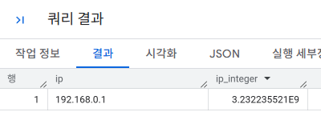
**IP 주소를 32비트 정수로 변환하는 이유 ($2^{24}, 2^{16}, 2^8, 2^0$ 승수 곱셈)**

IPv4 주소는 점(`.`)으로 구분된 4개의 10진수 옥텟(각 8비트, 0~255 범위)으로 구성된 **총 32비트(bit) 크기의 이진수 데이터**입니다.

이 4개의 옥텟을 32비트 정수의 원래 비트 자리(자릿수)에 배치하여 **하나의 단일 32비트 정수(Integer)**로 결합하기 위해 비트 시프트(승수 곱셈)를 적용합니다.

---

| 옥텟 구분 | 점 표기 위치 예시 (`192.168.0.1`) | 차지하는 비트 구간 | 필요한 이동량 | 승수 및 계산 방식 |
| :--- | :---: | :---: | :---: | :--- |
| **1번째 옥텟** | `192` | 25~32번째 비트 | 24비트 왼쪽 시프트 | $\times 2^{24}$ (`POW(2, 24)`) |
| **2번째 옥텟** | `168` | 17~24번째 비트 | 16비트 왼쪽 시프트 | $\times 2^{16}$ (`POW(2, 16)`) |
| **3번째 옥텟** | `0` | 9~16번째 비트 | 8비트 왼쪽 시프트 | $\times 2^8$ (`POW(2, 8)`) |
| **4번째 옥텟** | `1` | 1~8번째 비트 | 시프트 없음 (0비트) | $\times 2^0 = 1$ (`POW(2, 0)`) |

---

* **정수 변환의 핵심 목적:**  
  * IP를 단순 문자열로 다루면 사전순 정렬 규칙 때문에 `'10.0.0.1'`보다 `'9.0.0.1'`이 더 큰 값으로 처리되는 오류가 발생합니다.
  * 단일 32비트 정수로 변환해 두면 `WHERE ip_int BETWEEN start_int AND end_int` 구문을 통해 IP 서브넷 대역 포함 여부나 크기 비교를 정확하고 빠르게 연산할 수 있습니다.

#### 2-6-3 IP 주소를 0으로 메우기
각 10진수 부분을 3자리 숫자가 되게 앞 부분을 0으로 메워서 문자열 생성
```sql
-- IP 주소를 0으로 메운 다음 문자열로 변환하는 쿼리
SELECT
  ip,
  CONCAT(
    LPAD(SPLIT(ip, '.')[SAFE_ORDINAL(1)], 3, '0'), -- 1. 첫 번째 옥텟을 3자리로 맞추고 앞쪽을 0으로 채움
    LPAD(SPLIT(ip, '.')[SAFE_ORDINAL(2)], 3, '0'), -- 2. 두 번째 옥텟을 3자리로 맞추고 앞쪽을 0으로 채움
    LPAD(SPLIT(ip, '.')[SAFE_ORDINAL(3)], 3, '0'), -- 3. 세 번째 옥텟을 3자리로 맞추고 앞쪽을 0으로 채움
    LPAD(SPLIT(ip, '.')[SAFE_ORDINAL(4)], 3, '0')  -- 4. 네 번째 옥텟을 3자리로 맞추고 앞쪽을 0으로 채움
  ) AS ip_padding
FROM
  (SELECT '192.168.0.1' AS ip) AS t;
```
 - LPAD 함수란?
 지정한 문자 수가 되게 문자열의 **왼쪽**을 메우는 함수
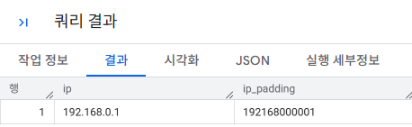
## 03. 하나의 테이블에 대한 조작 

### 3-1 그룹의 특징 잡기
- 집계 함수
  - COUNT: 지정한 컬럼의 레코드 수 리턴
    - 컬럼 앞메 DISTINCT 구문을 지정하면, 중복을 제외한 레코드 수 리턴
  - SUM: 합계(NULL은 제외)
  - AVG: 평균(NULL은 제외)
  - MAX/MIN: 최댓값/최솟값

#### 3-1-1 테이블 전체의 특징량 계산하기
```sql
-- 집계 함수를 사용해서 테이블 전체의 특징량을 계산하는 쿼리
SELECT
  COUNT(*) AS total_count,                               -- 1. 전체 행 수 계산
  COUNT(DISTINCT user_id) AS user_count,                 -- 2. 중복을 제외한 고유 사용자 수 계산
  COUNT(DISTINCT product_id) AS product_count,           -- 3. 중복을 제외한 고유 상품 수 계산
  SUM(score) AS sum,                                     -- 4. 리뷰 평점(score)의 총합 계산
  AVG(score) AS avg,                                     -- 5. 리뷰 평점(score)의 평균 계산
  MAX(score) AS max,                                     -- 6. 리뷰 평점의 최댓값 반환
  MIN(score) AS min                                      -- 7. 리뷰 평점의 최솟값 반환
FROM `1st_week.review`;
```

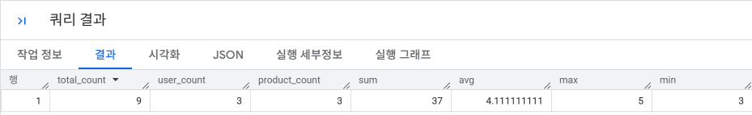

#### 3-1-2 그루핑한 데이터의 특징량 계산하기

GROUP BY 구문을 사용해 데이터를 더 작게 분할 가능
```sql
-- 사용자 기반으로 데이터를 분할하고 집약 함수를 적용
SELECT
  user_id,
  COUNT(*) AS total_count,                     -- 1. 사용자별 작성한 전체 리뷰 수 집계
  COUNT(DISTINCT product_id) AS product_count, -- 2. 사용자별 리뷰를 남긴 고유 상품 수 집계
  SUM(score) AS sum,                           -- 3. 사용자별 부여한 평점 총합 계산
  AVG(score) AS avg,                           -- 4. 사용자별 부여한 평점 평균 계산
  MAX(score) AS max,                           -- 5. 사용자별 부여한 최고 평점 반환
  MIN(score) AS min                            -- 6. 사용자별 부여한 최저 평점 반환
FROM `1st_week.review`
GROUP BY
  user_id
ORDER BY user_id ASC; 
```
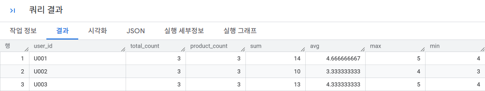
### 3-2 그룹 내부의 순서
#### 3-2-1 ORDER BY 구문으로 순서 정의하기 + 분석 함수
-ORDER BY ASC/DESC: 오름차순/내립차순
- 분석 함수
  - 각 Row 별로 세부적인 계산을 할 수 있도록 도와준다.
  - ROW_NUMBER(), RANK(), DENSE_RANK(), LEAD(), LAG() 등이 있다.

- 쿼리 효율성을 높이는 분석 함수
  - 전통적인 집계 함수와 달리 사전에 데이터를 그룹화할 필요가 없다.
  - 중간 결과물의 저장과 재처리를 최소화

- 순위 결정 함수로 데이터 순서 매기기
  - `ROW_NUMBER()`: 동일한 값이라도 **순차적으로 고유한 번호를 부여**함.
  - `RANK()`: 동일한 값이면 같은 순위이지만 **다음 순위는 건너뜀**.
  - `DENSE_RANK()`: 동일한 값이면 같은 순위이지만 **순위가 연속됨**.
- 데이터 변화를 추적하는 분석 함수

| 함수  | 설명 | 사용 예시 |
|-------|------|----------|
| `LEAD(column, offset, default) OVER (PARTITION BY col ORDER BY col2)` | 현재 행을 기준으로 '다음' `offset` 번째 행의 값을 반환 | `LEAD(sales, 1, 0) OVER (PARTITION BY region ORDER BY date)` |
| `LAG(column, offset, default) OVER (PARTITION BY col ORDER BY col2)`  | 현재 행을 기준으로 '이전' `offset` 번째 행의 값을 반환 | `LAG(sales, 1, 0) OVER (PARTITION BY region ORDER BY date)` |

```
-- 윈도 함수의 ORDER BY 구문을 사용해 테이블 내부의 순서를 다루는 쿼리
SELECT
  product_id,
  score,

  -- 1. 순위 매기기 함수군
  ROW_NUMBER() OVER(ORDER BY score DESC) AS row,        -- 동점이어도 중복 없이 고유한 순위 부여 (1, 2, 3, 4...)
  RANK()       OVER(ORDER BY score DESC) AS rank,       -- 동점 시 같은 순위 부여 후 다음 순위 건너뜀 (1, 2, 2, 4...)
  DENSE_RANK() OVER(ORDER BY score DESC) AS dense_rank, -- 동점 시 같은 순위 부여하되 다음 순위를 건너뛰지 않음 (1, 2, 2, 3...)

  -- 2. 앞선 행(이전 데이터) 추출 함수군
  LAG(product_id)    OVER(ORDER BY score DESC) AS lag1, -- 현재 행 기준 바로 앞(1개 전) 행의 product_id
  LAG(product_id, 2) OVER(ORDER BY score DESC) AS lag2, -- 현재 행 기준 2개 앞 행의 product_id

  -- 3. 뒤처진 행(다음 데이터) 추출 함수군
  LEAD(product_id)    OVER(ORDER BY score DESC) AS lead1, -- 현재 행 기준 바로 뒤(1개 다음) 행의 product_id
  LEAD(product_id, 2) OVER(ORDER BY score DESC) AS lead2  -- 현재 행 기준 2개 뒤 행의 product_id
FROM `1st_week.popular_products`
ORDER BY row ASC;
```
- OVER (...) 절은 윈도우 함수가 어떤 범위와 순서로 계산될지를 결정하는 `창문(Window)` 역할
```sql
OVER (
  PARTITION BY <그룹기준>  -- (선택) 그룹별로 순위를 따로 매길 때 (예: 카테고리별 순위)
  ORDER BY <정렬기준>      -- (필수/권장) 순위를 매길 기준 컬럼 및 정렬 방향 (ASC/DESC)
)
```
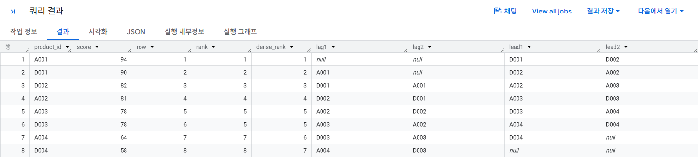

#### 3-2-2 ORDER BY 구문과 집계 함수 조합하기
ORDER BY 구문과 SUM/AVG 등의 집약 함수를 조합하면, 집약 함수의 적용 범위를 유연하게 지정 가능.
```SQL
-- ORDER BY 구문과 집계 함수를 조합해서 계산하는 원리
SELECT
  product_id,
  score,

  -- 1. 고유 순위 부여
  ROW_NUMBER() OVER(
    ORDER BY score DESC
  ) AS row, -- 점수 내림차순 기준 고유한 순위 부여 (1, 2, 3, 4...)

  -- 2. 순위 상위부터 현재 행까지의 누계 점수 계산
  SUM(score) OVER(
    ORDER BY score DESC
    ROWS BETWEEN UNBOUNDED PRECEDING AND CURRENT ROW
  ) AS cum_score, -- 최상위 행부터 현재 행까지의 score 누적 합계

  -- 3. 이전 행, 현재 행, 다음 행(총 3개 행)의 이동 평균 계산
  AVG(score) OVER(
    ORDER BY score DESC
    ROWS BETWEEN 1 PRECEDING AND 1 FOLLOWING
  ) AS local_avg, -- 직전 1개 행부터 직후 1개 행까지의 평균

  -- 4. 전체 범위 내 최고 순위의 상품 ID 추출
  FIRST_VALUE(product_id) OVER(
    ORDER BY score DESC
    ROWS BETWEEN UNBOUNDED PRECEDING AND UNBOUNDED FOLLOWING
  ) AS first_value, -- 전체 파티션/정렬 범위 내 최상위(첫 번째) 상품 ID

  -- 5. 전체 범위 내 최저 순위의 상품 ID 추출
  LAST_VALUE(product_id) OVER(
    ORDER BY score DESC
    ROWS BETWEEN UNBOUNDED PRECEDING AND UNBOUNDED FOLLOWING
  ) AS last_value -- 전체 파티션/정렬 범위 내 최하위(마지막) 상품 ID
FROM `1st_week.popular_products`
ORDER BY row ASC;
```
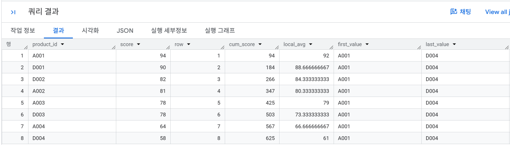

#### 3-2-3 윈도 프레임 지정에 대해서
**윈도 프레임 지정이란?**  
현재 레코드(현재 행)의 위치를 기준으로 **연산에 포함할 상대적인 행들의 범위(Window)**를 정의하는 구문입니다.

---

**기본 구문 형식**

```sql
ROWS BETWEEN <start> AND <end>
```
- 윈도 프레임 지정 핵심 키워드 정리(START와 END에 들어갈 것들)

| 키워드 | 구분 | 대상 범위 | 연산 기준점 및 설명 |
| :--- | :---: | :--- | :--- |
| **`CURRENT ROW`** | 위치 기준 | 현재 행 | 집계 연산의 기준이 되는 현재 레코드 자체 |
| **`n PRECEDING`** | 상대 범위 (이전) | 현재 행 기준 앞선 $n$개 행 | 정렬 순서상 현재 행보다 위에 위치한 $n$번째 레코드 |
| **`n FOLLOWING`** | 상대 범위 (이후) | 현재 행 기준 뒤따르는 $n$개 행 | 정렬 순서상 현재 행보다 아래에 위치한 $n$번째 레코드 |
| **`UNBOUNDED PRECEDING`** | 절대 범위 (시작점) | 파티션의 첫 번째 행부터 | 정렬 기준 최상단(시작 지점)부터 범위를 제한 없이 포함 |
| **`UNBOUNDED FOLLOWING`** | 절대 범위 (종료점) | 파티션의 마지막 행까지 | 정렬 기준 최하단(종료 지점)까지 범위를 제한 없이 포함 |

```SQL
-- 윈도 프레임 지정별 상품 id를 집약하는 쿼리
SELECT
  product_id,

  -- 1. 점수 순서로 고유 순위 부여
  ROW_NUMBER() OVER(ORDER BY score DESC) AS row,

  -- 2. 첫 순위부터 마지막 순위까지 전체 범위의 상품 ID를 배열로 집약
  ARRAY_AGG(product_id) OVER(
    ORDER BY score DESC
    ROWS BETWEEN UNBOUNDED PRECEDING AND UNBOUNDED FOLLOWING
  ) AS whole_agg, -- 전체 상품 ID 목록 생성

  -- 3. 첫 순위부터 현재 순위까지의 상품 ID를 누적 배열로 집약
  ARRAY_AGG(product_id) OVER(
    ORDER BY score DESC
    ROWS BETWEEN UNBOUNDED PRECEDING AND CURRENT ROW
  ) AS cum_agg, -- 현재 행까지 누적된 상품 ID 배열 생성

  -- 4. 앞선 1행, 현재 행, 다음 1행(총 3개 행)의 상품 ID를 배열로 집약
  ARRAY_AGG(product_id) OVER(
    ORDER BY score DESC
    ROWS BETWEEN 1 PRECEDING AND 1 FOLLOWING
  ) AS local_agg -- 인접 3개 행의 상품 ID 배열 생성

FROM `1st_week.popular_products`
WHERE category = 'action'
ORDER BY row;
```
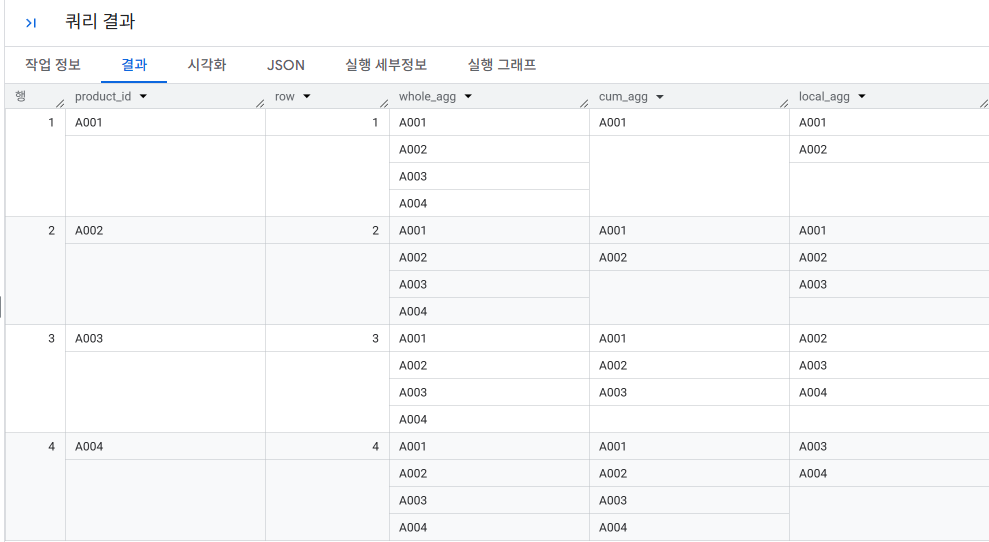
- 윈도 함수에 프레임 지정을 하지 않으면 ORDER BY 구문이 없는 경우 모든 행, ORDER BY 구문이 있는 경우 첫 행에서 현재 행까지가 디폴트 프레임으로 지정됨

- STRING_AGG 함수와 ARRAY_AGG 함수
| 구분 | `STRING_AGG` | `ARRAY_AGG` |
| :--- | :--- | :--- |
| **반환 데이터 타입** | `STRING` (구분자로 연결된 단일 문자열) | `ARRAY<T>` (원본 자료형을 유지하는 배열) |
| **기본 구문** | `STRING_AGG([DISTINCT] 컬럼, '구분자' [ORDER BY ...])` | `ARRAY_AGG([DISTINCT] 컬럼 [ORDER BY ...] [LIMIT n])` |
| **구분자 지정** | 필수 (생략 불가, 예: `','`) | 불필요 (배열 구조 자체로 저장) |
| **정렬 (`ORDER BY`)** | 지원 (`STRING_AGG(id, ',' ORDER BY id ASC)`) | 지원 (`ARRAY_AGG(id ORDER BY id ASC)`) |
| **중복 제거 (`DISTINCT`)** | 지원 (`STRING_AGG(DISTINCT id, ',')`) | 지원 (`ARRAY_AGG(DISTINCT id)`) |
| **개수 제한 (`LIMIT`)** | 미지원 | **지원** (`ARRAY_AGG(id ORDER BY score DESC LIMIT 3)`) |
| **`NULL` 값 처리** | `NULL` 값 자동 제외 | `NULL`도 요소로 포함 (제외 시 `IGNORE NULLS` 명시) |
| **주요 활용 목적** | 최종 보고서/대시보드 표시, CSV 형태 결합 | 후속 연산(`UNNEST`, 인덱싱), 배열 다루기 |

#### 3-2-4 PARTITION BY와 ORDER BY 조합하기
```SQL
-- 윈도 함수를 사용해 카테고리들의 순위를 계산하는 행위
SELECT
  category,
  product_id,
  score,

  -- 1. 카테고리별로 점수 순서로 정렬하고 유일한 순위를 붙임
  ROW_NUMBER() OVER(PARTITION BY category ORDER BY score DESC) AS row,

  -- 2. 카테고리별로 같은 순위를 허용하고 다음 순위를 건너뛰며 순위를 붙임
  RANK()       OVER(PARTITION BY category ORDER BY score DESC) AS rank,

  -- 3. 카테고리별로 같은 순위를 허용하되 다음 순위를 건너뛰지 않고 순위를 붙임
  DENSE_RANK() OVER(PARTITION BY category ORDER BY score DESC) AS dense_rank

FROM `1st_week.popular_products`
ORDER BY category, row;
```
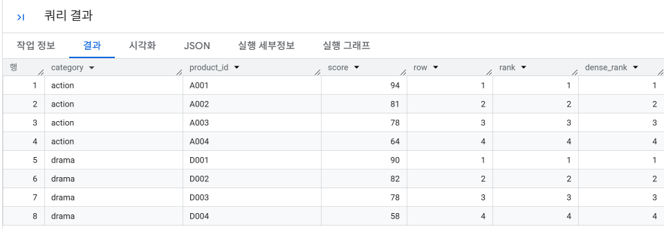

#### 3-2-4-1 각 카테고리의 상위 n개 추출하기

윈도 함수를 WHERE 구문에 작성할 수 없으므로, SELECT 구문에서 윈도 함수를 사용한 결과를 서브 쿼리로 만들고 외부에서 WHERE 구문을 적용해야 함.
```SQL
-- 카테고리들의 순위 상위 2개까지의 상품을 추출하는 쿼리
SELECT *
FROM (
  SELECT
    category,
    product_id,
    score,
    ROW_NUMBER() OVER(PARTITION BY category ORDER BY score DESC) AS rank
  FROM `1st_week.popular_products`
) AS popular_products_with_rank -- 서브쿼리에서 ROW_NUMBER() 윈도우 함수로 카테고리별 고유 순위 부여
WHERE rank <= 2
ORDER BY category, rank;
```
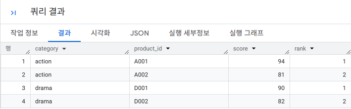
```SQL
-- 카테고리별 순위 최상위 상품을 추출하는 쿼리
SELECT DISTINCT -- 중복 행 제거
  category,
  FIRST_VALUE(product_id) OVER(
    PARTITION BY category
    ORDER BY score DESC
    ROWS BETWEEN UNBOUNDED PRECEDING AND UNBOUNDED FOLLOWING
  ) AS product_id -- 카테고리별로 점수가 가장 높은 상품 ID ,  사실 ROWS~~ 는 불필요(첫 행을 추출하기 떄문, LAST_VALUE의 경우 무조건 필요)
FROM `1st_week.popular_products`
ORDER BY category;
```
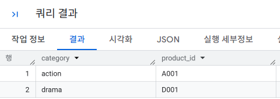
### 3-3 세로 기반 데이터를 가로 기반으로 변환하기

SQL은 행 기반으로 처리하는 것이 기본, 따라서 데이터 저장 시에는 최대한 데이터를 분할해서 저장하는 것이 좋음.<br>
하지만, 최종 출력에서는 데이터를 열로 전개해야 가독성이 높은 경우가 많음

#### 3-3-1 행을 열로 변환하기
```sql
SELECT
  dt, -- 일자 기준 컬럼
  MAX(CASE WHEN indicator = 'impressions' THEN val END) AS impressions,
  MAX(CASE WHEN indicator = 'sessions'    THEN val END) AS sessions,
  MAX(CASE WHEN indicator = 'users'       THEN val END) AS users
FROM `1st_week.daily_kpi` 
GROUP BY dt 
ORDER BY dt;
```

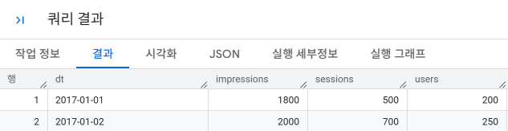

#### 3-3-2 행을 쉼표로 구분한 문자열로 집약하기
```sql
SELECT
    purchase_id,
    STRING_AGG(product_id, ',') AS product_ids, -- 상품 ID를 쉼표로 연결하여 하나의 문자열로 집약
    SUM(price) AS amount
FROM `1st_week.purchase_detail_log`
GROUP BY purchase_id
ORDER BY purchase_id;
```

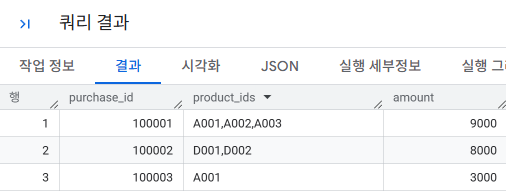
### 3-4 가로 기반 데이터를 세로 기반으로 변환하기
#### 3-4-1 열로 표현된 값을 행으로 변환하기

가로 기반 데이터의 특징: 각 행의 데이터 개수가 같음<br>
행 전개(Unpivot) 원리: 가로로 늘어선 컬럼을 세로 행으로 쪼개기 위해, 컬럼 수(4개)만큼 순번(idx: 1, 2, 3, 4)을 갖는 피벗 테이블을 만들어 CROSS JOIN
결합 후 CASE 문을 사용하여 idx 번호에 따라 해당하는 분기명(quarter)과 해당 분기의 컬럼 값(sales)을 각각 추출합니다.

```sql
SELECT
  q.year, -- 기준 연도

  -- 1. Q1에서 Q4까지의 레이블 이름 출력
  CASE
    WHEN p.idx = 1 THEN 'q1' -- idx가 1이면 1분기 라벨 매핑
    WHEN p.idx = 2 THEN 'q2' -- idx가 2이면 2분기 라벨 매핑
    WHEN p.idx = 3 THEN 'q3' -- idx가 3이면 3분기 라벨 매핑
    WHEN p.idx = 4 THEN 'q4' -- idx가 4이면 4분기 라벨 매핑
  END AS quarter,

  -- 2. Q1에서 Q4까지의 매출 출력
  CASE
    WHEN p.idx = 1 THEN q.q1 -- idx가 1이면 q1 컬럼의 매출값 매핑
    WHEN p.idx = 2 THEN q.q2 -- idx가 2이면 q2 컬럼의 매출값 매핑
    WHEN p.idx = 3 THEN q.q3 -- idx가 3이면 q3 컬럼의 매출값 매핑
    WHEN p.idx = 4 THEN q.q4 -- idx가 4이면 q4 컬럼의 매출값 매핑
  END AS sales

FROM `1st_week.quarterly_sales` AS q
CROSS JOIN
  -- 행으로 전개하고 싶은 열의 수만큼 순번(idx) 테이블 만들기
  (
              SELECT 1 AS idx
    UNION ALL SELECT 2 AS idx
    UNION ALL SELECT 3 AS idx
    UNION ALL SELECT 4 AS idx
  ) AS p
ORDER BY q.year, p.idx;
```

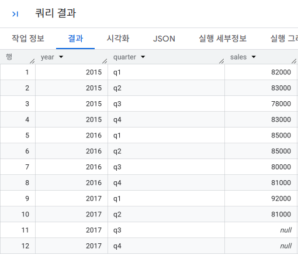

#### 3-4-2 임의의 길이를 가진 배열을 행으로 전개하기

- 테이블 함수 이용
  - 리턴값이 테이블인 함수
  - BigQuery에는 unnest 함수가 있음

- UNNEST 함수란?
```
1. 형식: UNNEST(배열_표현식)
2. 역할: 배열(ARRAY) 안에 담긴 요소들을 풀어서 개별 행(Row)으로 전개(언피벗)함
3. 주로 FROM 또는 JOIN 절에서 테이블처럼 참조하여 사용함
```
```sql
-- 테이블 함수를 사용해 배열을 행으로 전개하는 쿼리
SELECT
  product_id
FROM
  UNNEST(ARRAY['A001', 'A002', 'A003']) AS product_id; -- BigQuery에서 UNNEST 함수는 FROM 구문 내부에서 테이블 함수로 사용: 스칼라 값과 테이블을 동시에 다룰 수 없기 때문
```

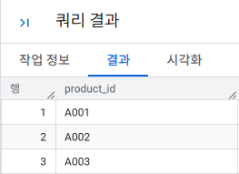

```sql
-- 테이블 함수를 사용해 쉼표로 구분된 문자열 데이터를 행으로 전개하는 쿼리 1
SELECT
  p.purchase_id,
  product_id -- SPLIT으로 쪼개고 UNNEST로 전개한 개별 상품 ID
FROM
  `1st_week.purchase_detail_log` AS p -- 원래 테이블
  CROSS JOIN
  UNNEST(SPLIT(p.product_id, ',')) AS product_id -- 쉼표로 쪼갠 배열을 테이블 행으로 교차 결합(전개)
ORDER BY purchase_id;
```
```sql
-- 테이블 함수를 사용해 쉼표로 구분된 문자열 데이터를 행으로 전개하는 쿼리 2(1과 기능 동일)
SELECT
  p.purchase_id,
  product_id
FROM
  `1st_week.purchase_detail_log` AS p,
  -- 1) SPLIT: 쉼표(',')로 구분된 문자열(product_ids)을 배열(ARRAY)로 분해
  -- 2) UNNEST: 배열 요소를 테이블 행으로 전개 (콤마(,)는 CROSS JOIN과 동일하게 동작)
  UNNEST(SPLIT(p.product_ids, ',')) AS product_id;
```
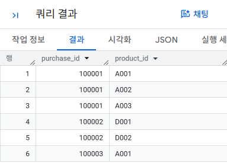
## 04. 여러 개의 테이블 조작하기
- 업무 데이터를 사용하는 경우   
업무 데이터는 여러 테이블로 나뉘어 관리하는 경우가 많음
- 로그 데이터를 사용하는 경우   
거대한 로그 파일이 하나의 테이블에 저장된 경우에도, 여러 처리를 실행하려면 여러 개의 SELECT 구문을 조합하거나, 자기 결합해서 레코드들을 비교하는 경우도 존재
### 4-1 여러 개의 테이블을 세로로 결합하기

비슷한 구조를 가지는 테이블의 데이터를 일괄 처리하고 싶은경우, UNION ALL 구문을 사용.

```sql
-- UNION ALL 구문을 사용해 테이블을 세로로 결합하는 쿼리
SELECT
  'app1' AS app_name, 
  user_id,
  name,
  email -- app2에는 phone 컬럼이 없으므로 제외
FROM `1st_week.app1_mst_users`

UNION ALL

SELECT
  'app2' AS app_name,
  user_id,
  name,
  NULL AS email       -- app2에는 email 컬럼이 없으므로 NULL로 설정
FROM `1st_week.app2_mst_users`;
```
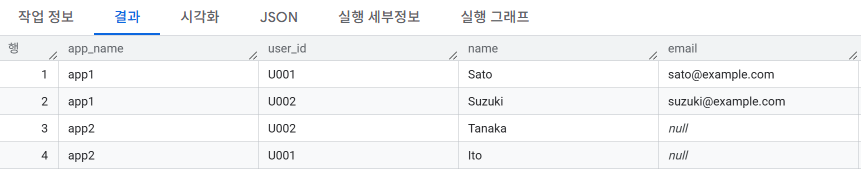

### 4-2 여러 개의 테이블을 가로로 정렬하기

JOIN을 사용하여 여러 개의 테이블을 가로 정렬   
⚠️ 마스터 테이블에 JOIN을 사용하여 결헙하지 못한 데이터가 사라지거나, 중복된 데이터가 발생하는 경우 주의

```sql
-- 여러 개의 테이블을 결합하여 가로로 정렬하는 쿼리
SELECT
  m.category_id,
  m.name,
  s.sales,          
  r.product_id AS sale_product
FROM `1st_week.mst_categories` AS m
  JOIN 
    `1st_week.category_sales` AS s
    ON m.category_id = s.category_id      -- 카테고리별 매출액 결합 (일치하는 category_id 기준)
  JOIN 
    `1st_week.product_sale_ranking` AS r
    ON m.category_id = r.category_id      -- 카테고리별 상품 순위 결합 (일치하는 category_id 기준)
ORDER BY m.category_id, r.rank;
```

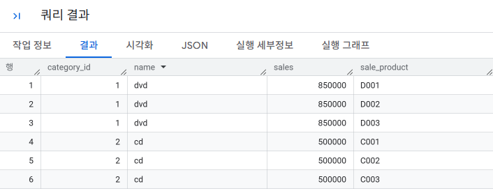
`↑ 마스터 테이블의 행 수 변경(3 → 6) 발생`

```sql
-- 마스터 테이블의 행 수를 변경하지 않고 여러 개의 테이블을 가로로 정렬하는 쿼리
SELECT
  m.category_id, 
  m.name,
  s.sales,
  r.product_id AS top_sale_product
FROM `1st_week.mst_categories` AS m
  LEFT JOIN `1st_week.category_sales` AS s
    ON m.category_id = s.category_id
  LEFT JOIN `1st_week.product_sale_ranking` AS r
    ON m.category_id = r.category_id
  AND r.rank = 1 -- 각 카테고리의 1위 상품만 추출
ORDER BY m.category_id;
```
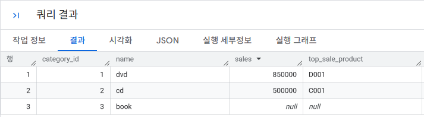
- SQL JOIN 쿼리 작성하는 흐름
  1. 테이블 확인: 테이블에 저장된 데이터, 컬럼 확인
  2. 기준 테이블 정의: 가장 많이 참고할 기준(base) 테이블 정의
  3. JOIN Key 찾기: 여러 테이블과 연결할 Key(ON) 정리
  4. 결과 예상하기: 결과 테이블을 예상해서 손, 엑셀로 작성
  5. 쿼리 작성/검증: 예상한 결과와 동일한 결과가 나오는지 확인

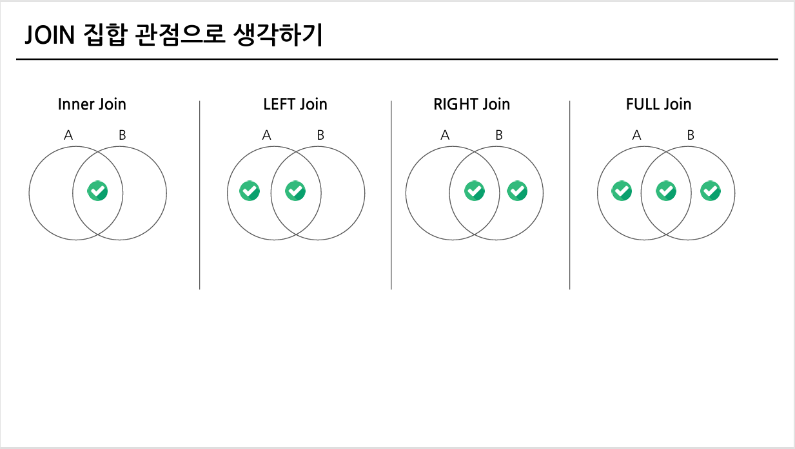

상관 서브쿼리의 경우 내부에서 ORDER BY구문과 LIMIT 구문을 사용하여 데이터 압축 가능

- 상관 서브쿼리와 스칼라 서브쿼리란?
```
스칼라 서브쿼리 (Scalar Subquery)
   - 단 하나의 값(1행 1열)만 반환하는 서브쿼리.
   - `SELECT`, `WHERE`, `ORDER BY` 절 등 단일 값이 필요한 위치에 컬럼처럼 사용할 수 있음.
상관 서브쿼리 (Correlated Subquery)
  - 서브쿼리 내부에서 외부 메인 쿼리의 컬럼을 참조(`WHERE s.id = m.id`)하는 형태.
  - 외부 쿼리의 각 행(Row)을 읽을 때마다 서브쿼리가 종속적으로 반복 실행되는 구조.
스칼라 상관 서브쿼리
  - `SELECT` 절 안에서 외부 테이블의 식별자 값을 참조하여, 행마다 딱 1개의 스칼라 값을 뽑아내는 서브쿼리.
```
`한줄 요약`
- 스칼라 서브쿼리: 반환되는 데이터의 규격이 "1행 1열(스칼라)"인가?

- 상관 서브쿼리: 서브쿼리가 "외부 쿼리의 컬럼을 가져다 쓰고 있는가"?

### 4-3 조건 플래그를 0과 1로 표현하기:SIGN 함수 이용

SIGN 함수란?
```
1. 형식: SIGN(숫자_컬럼_또는_표현식)
2. 역할: 수치 데이터의 '부호를 판정'하여 양수는 1, 0은 0, 음수는 -1로 단순화된 정수를 반환함
3. 대상 값이 NULL이면 NULL을 반환함
```

```sql
-- 신용 카드 등록과 구매 이력 유무를 0과 1이라는 플래그로 나타내는 쿼리
SELECT
  m.user_id,
  m.card_number,
  COUNT(p.user_id) AS purchase_count,                                    -- 총 구매 횟수 집계
  CASE WHEN m.card_number IS NOT NULL THEN 1 ELSE 0 END AS has_card,      -- 신용카드 번호 등록 여부 플래그 (등록: 1, 미등록: 0):CASE 함수 이용
  SIGN(COUNT(p.user_id)) AS has_purchased                                -- 구매 이력 유무 플래그 (1회 이상: 1, 0회: 0): SIGN 함수 이용
FROM `1st_week.mst_users_with_card_number` AS m
LEFT JOIN `1st_week.purchase_log` AS p
  ON m.user_id = p.user_id
GROUP BY m.user_id, m.card_number
ORDER BY m.user_id;
```
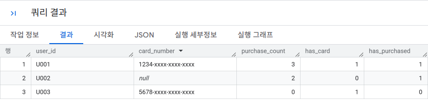

### 4-4 계산한 테이블에 이름 붙여 재사용하기

CTE를 사용하여 코드의 가독성을 높일 수 있다.

```sql
여기에 코드를 적어주세요.
```

<!-- 이 부분을 지우고 실행 결과 화면을 제출해주세요. -->

### 4-5 유사 테이블 만들기

<!-- 이 부분을 지우고 새롭게 배운 내용을 자유롭게 정리해주세요. -->

```sql
여기에 코드를 적어주세요.
```

<!-- 이 부분을 지우고 실행 결과 화면을 제출해주세요. -->


### 🎉 수고하셨습니다.
