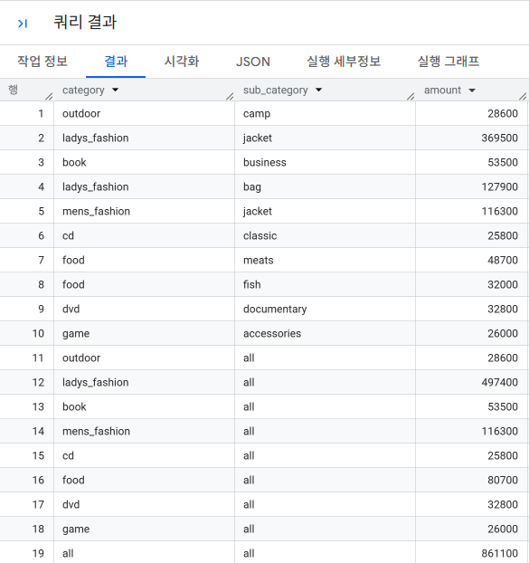
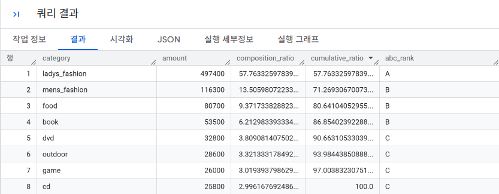
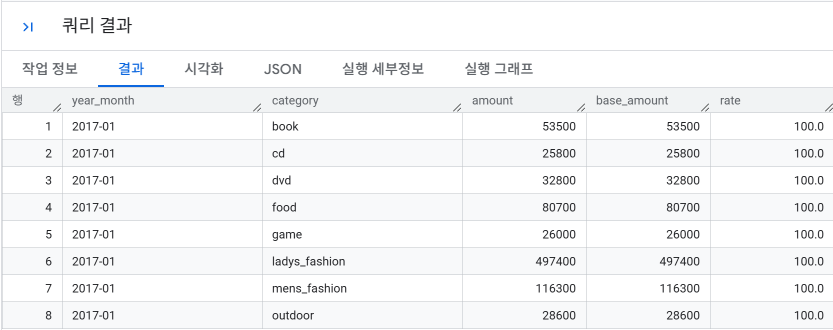

# SQL_MASTER 2주차 정규과제

📌SQL MASTER 정규과제는 매주 정해진 분량의 『*데이터 분석을 위한 SQL 레시피*』 를 읽고 학습하는 것입니다. 이번 주는 아래의 **SQL_MASTER_2nd_TIL**에 나열된 분량을 읽고 공부하시면 됩니다.

아래 실습을 수행하며 학습 내용을 직접 적용해보세요. 단순히 결과를 재현하는 것이 아니라, SQL을 직접 작성하는 과정에서 개념을 스스로 정리하는 것이 중요합니다.

필요한 경우 교재와 추가 자료를 참고하여 이해를 보완하시기 바랍니다.

## SQL_MASTER_2nd_TIL

### 4장 매출을 파악하기 위한 데이터 추출
#### 1. 시계열 기반으로 데이터 집계하기
#### 2. 다면적인 축을 사용해 데이터 집계하기 


## Study Schedule

| 주차  | 공부 범위     | 완료 여부 |
| ----- | ------------- | --------- |
| 1주차 | p.52~136   | ✅         |
| 2주차 | p.138~184  | ✅         |
| 3주차 | p.186~232 | 🍽️         |
| 4주차 | p.233~321 | 🍽️         |
| 5주차 | p.324~406 | 🍽️         |
| 6주차 | p.408~464 | 🍽️         |
| 7주차 | p.466~566 | 🍽️         |

<br>

<!-- 여기까진 그대로 둬 주세요-->

# 실습

## 0. 실습 규칙

1. 샘플 데이터 생성 코드는 **08_SQL_MASTER_Template/src** 경로에 장별로 정리되어 있습니다.
2. 아래 목차에 맞춰 해당 코드를 실행하여 샘플 데이터를 생성한 후, 각 장에서 요구하는 쿼리를 직접 작성해보시기 바랍니다.
3. 작성한 쿼리의 **실행 결과 화면도 함께 제출**해 주세요.
4. 단순히 교재의 예시 코드를 그대로 작성하는 것이 아니라, **제시된 로직을 충분히 이해한 뒤 교재를 보지 않고 스스로 쿼리를 구성**해보는 것을 권장합니다.
5. 교재 예시는 PostgreSQL, Hive, BigQuery 등 다양한 DBMS 기준으로 제시되어 있기 때문에, **MySQL이 아닌 다른 SQL 환경을 사용하여 실습을 진행해도 무방합니다.**
6. 다만, 사용 중인 DBMS에 맞는 문법으로 적절히 변환하여 작성하시기 바랍니다.


## 1. 시계열 기반으로 데이터 집계하기

### 1-1 날짜별 매출 집계하기

매출을 집계하는 업무에서는 가로 축에 날짜, 세로 축에 금액을 표현하는 그래프를 사용

```sql
여기에 코드를 적어주세요.
```

<!-- 이 부분을 지우고 실행 결과 화면을 제출해주세요. -->
 
### 1-2 이동평균을 사용한 날짜별 추이 보기

<!-- 이 부분을 지우고 새롭게 배운 내용을 자유롭게 정리해주세요. -->

```sql
여기에 코드를 적어주세요.
```

<!-- 이 부분을 지우고 실행 결과 화면을 제출해주세요. -->
 
### 1-3 당월 매출 누계 구하기

<!-- 이 부분을 지우고 새롭게 배운 내용을 자유롭게 정리해주세요. -->

```sql
여기에 코드를 적어주세요.
```

<!-- 이 부분을 지우고 실행 결과 화면을 제출해주세요. -->

### 1-4 월별 매출의 작대비 구하기

<!-- 이 부분을 지우고 새롭게 배운 내용을 자유롭게 정리해주세요. -->

```sql
여기에 코드를 적어주세요.
```

<!-- 이 부분을 지우고 실행 결과 화면을 제출해주세요. -->
 
### 1-5 Z 차트로 업적의 추이 확인하기

<!-- 이 부분을 지우고 새롭게 배운 내용을 자유롭게 정리해주세요. -->

```sql
여기에 코드를 적어주세요.
```

<!-- 이 부분을 지우고 실행 결과 화면을 제출해주세요. -->
 
### 1-6 매출을 파악할 때 중요 포인트 

<!-- 이 부분을 지우고 새롭게 배운 내용을 자유롭게 정리해주세요. -->

```sql
여기에 코드를 적어주세요.
```

<!-- 이 부분을 지우고 실행 결과 화면을 제출해주세요. -->


## 2. 다면적인 축을 사용해 데이터 집계하기

- 매출의 시계열뿐만 아니라 상품의 카테고리, 가격 등을 조합해서 데이터의 특징을 추출해 리포팅하기

### 2-1 카테고리별 매출과 소계 계산하기

리포트 업무는 전체적인 수치 개요를 전하면서, 해당 내역을 다양한 관점에서 사용해야 함: 드릴다운(차원의 계층에 따라 분석에 필요한 요약 수준을 바꿀 수 있는 기능)이 필요

```sql
-- 카테고리별 매출과 소계를 동시에 구하는 쿼리
WITH
-- 1. [소 카테고리 단위 상세 집계]
--    대분류와 소분류를 모두 보존하므로 'all'을 쓰지 않고 실제 컬럼명을 그대로 그룹화합니다.
sub_category_amount AS (
  SELECT
    category,                            -- 대분류 카테고리 (예: ladys_fashion, food 등)
    sub_category,                        -- 소분류 카테고리 (예: bag, jacket, meats 등)
    SUM(price) AS amount                 -- 소분류 단위의 매출 합계
  FROM `2nd_week.purchase_detail_log`
  GROUP BY
    category, sub_category
),

-- 2. [대 카테고리 단위 소계 집계]
--    소분류를 가리지 않고 '해당 대분류의 전체 합계'를 구한 것이므로, sub_category 자리에 'all' 라벨을 고정 부여합니다.
category_amount AS (
  SELECT
    category,                            -- 대분류 카테고리 (그룹화 기준)
    'all'      AS sub_category,          -- ★ 'all': "이 대분류의 모든 소분류를 합산한 소계"임을 나타내는 텍스트 라벨
    SUM(price) AS amount                 -- 대분류 단위의 매출 소계
  FROM `2nd_week.purchase_detail_log`
  GROUP BY
    category
),

-- 3. [전체 총매출 집계]
--    대분류와 소분류를 가리지 않고 '모든 데이터의 종합 합계'이므로, 두 컬럼 모두에 'all' 라벨을 고정 부여합니다.
total_amount AS (
  SELECT
    'all'      AS category,              -- ★ 'all': "모든 대분류를 합친 전체"임을 나타내는 텍스트 라벨
    'all'      AS sub_category,          -- ★ 'all': "모든 소분류를 합친 전체"임을 나타내는 텍스트 라벨
    SUM(price) AS amount                 -- 전체 데이터의 총매출(Grand Total)
  FROM `2nd_week.purchase_detail_log`
)

-- 4. [UNION ALL 결합]
--    세 집계 결과 테이블의 스키마 규격(category, sub_category, amount)을 맞추어 하나의 보고서로 세로 병합합니다.
          SELECT category, sub_category, amount FROM sub_category_amount -- 소분류별 상세 데이터 (예: ladys_fashion | bag | 금액)
UNION ALL SELECT category, sub_category, amount FROM category_amount     -- 대분류별 소계 데이터 (예: ladys_fashion | all | 금액)
UNION ALL SELECT category, sub_category, amount FROM total_amount;       -- 전체 총계 데이터     (예: all           | all | 금액)

```
💡 `all` 핵심 정리<br>
- `all`은 SQL 시스템 예약어나 명령어가 아니라, 사용자가 직접 입력한 고정 문자열(라벨)입니다.

- UNION ALL로 테이블들을 합칠 때 컬럼 개수와 형태가 똑같아야 하므로, **그룹화에서 제외되어 비어버린 컬럼 자리에 "이 컬럼 전체를 합산한 결과임"을 알아볼 수 있도록** `all`을 채워 넣은 것입니다.

```sql
SELECT
  -- 1. ROLLUP으로 생성된 NULL(소계/총계 자리)을 'all'이라는 문자열로 변경
  COALESCE(category, 'all')     AS `대분류`, -- 대카테고리 표시 (전체 총계 행에서는 NULL이므로 'all'로 치환)
  COALESCE(sub_category, 'all') AS `소분류`, -- 소카테고리 표시 (대분류 소계 행에서는 NULL이므로 'all'로 치환)

  -- 2. 그룹별/소계별/총계별 매출 합계 계산
  SUM(price) AS `매출`   -- 세부 항목 매출, 대분류 소계, 전체 총계 금액을 계산[cite: 2]

FROM `2nd_week.purchase_detail_log`

-- 3. 계층적 소계/총계를 자동 생성하는 ROLLUP 구문
GROUP BY ROLLUP(category, sub_category) 
  -- ① (category, sub_category): 소카테고리별 상세 집계
  -- ② (category): 대카테고리별 소계 집계 (sub_category 자리는 NULL이 됨)
  -- ③ (): 전체 총계 집계 (category, sub_category 둘 다 NULL이 됨)

-- 4. 표 보기 순서(전체 총계 -> 대분류 소계 -> 세부 항목)를 맞추기 위한 정렬
ORDER BY
  -- 1단계: 전체 총계(category가 NULL인 행)를 맨 위로 올림 (NULL이면 0, 일반 데이터는 1)[cite: 3]
  CASE WHEN category IS NULL THEN 0 ELSE 1 END,
  category, -- 같은 대분류끼리 가나다순 정렬

  -- 2단계: 대분류 내에서 소계(sub_category가 NULL인 행)를 세부 항목보다 위에 배치 (NULL이면 0, 일반 데이터는 1)[cite: 3]
  CASE WHEN sub_category IS NULL THEN 0 ELSE 1 END,
  sub_category; -- 세부 소카테고리 항목들끼리 가나다순 정렬
```
- ROLLUP 구문이란?
```
1. 형식: GROUP BY ROLLUP(기준_컬럼1, 기준_컬럼2, ...)
2. 역할: 나열된 컬럼의 오른쪽부터 하나씩 제외하며 '소계'와 '전체 총계'를 계층적으로 자동 계산함
3. 집계된 상위 행(소계/총계 자리)의 빈 컬럼에는 기본값으로 NULL이 
```

### 2-2 ABC 분석으로 잘 팔리는 상품 판별하기

ABC 분석: 재고 관리 등에서 사용. 매출 중요도에 따라 상품을 나누고, 그에 맞게 전략을 만들 떄 사용
```
A 등급: 상위 0~70%
B 등급: 상위 79~90%
C 등급: 상위 90~100%
```
- ABC 분석에 사용하는 데이터 작성 방법
1. 매출이 높은 순서로데이터 정렬
2. 매출 합계를 집계
3. 매출 합계를 기반으로 각 데이터가 차지하는 비율을 계산하고, 구성비 도출
4. 계산한 카테고리의 구성비를 기반으로 구성비 누계 구하기(카테고리의 매출과 해당 시점까지의 누계를 따로 계산한 뒤, 총 매출로 나누기)

```sql
WITH
-- 1. 월간 카테고리별 매출액 집계
monthly_sales AS (
  SELECT
    category,                           -- 대카테고리명
    SUM(price) AS amount                -- 카테고리별 총 매출 합계
  FROM `2nd_week.purchase_detail_log`   -- 구매 상세 로그 테이블
  WHERE
    dt ='2017-01-18'
  GROUP BY
    category
),

-- 2. 구성비율(%)과 누적 구성비율(%) 계산
sales_composition_ratio AS (
  SELECT
    category,
    amount,
    100.0 * amount / SUM(amount) OVER() AS composition_ratio,-- 구성비: 100.0 * <항목별 매출> / <전체 매출>
    100.0 * SUM(amount) OVER(
      ORDER BY amount DESC
      ROWS BETWEEN UNBOUNDED PRECEDING AND CURRENT ROW
    ) / SUM(amount) OVER() AS cumulative_ratio -- 구성비누계: 100.0 * <매출 상위부터 현재 항목까지의 누적 매출> / <전체 매출>
  FROM monthly_sales
)

-- 3. 구성비누계 범위에 따라 파레토 ABC 등급 부여
SELECT
  *,
  CASE
    WHEN cumulative_ratio BETWEEN 0 AND 70  THEN 'A' -- 누적 70% 이하: 최우수 핵심 품목 (A등급)
    WHEN cumulative_ratio BETWEEN 70 AND 90 THEN 'B' -- 누적 70~90% 구간: 일반 주력 품목 (B등급)
    WHEN cumulative_ratio BETWEEN 90 AND 100 THEN 'C' -- 누적 90~100% 구간: 비인기 관리 품목 (C등급)
  END AS abc_rank
FROM sales_composition_ratio
ORDER BY
  amount DESC; -- 매출이 높은 순서로 내림차순 정렬
```



### 2-3 팬 차트로 상품의 매출 증가율 확인하기

팬 차트: 어떤 기준 시점을 100%로 두고, 이후의 숫자 변동을 확인할 수 있게 해주는 그래프, 성장과 쇠퇴를 쉽게 파악할 수 있다.


```sql
WITH
-- 1. 일별, 카테고리별 매출 집계 및 날짜(연, 월, 일) 분해
daily_category_amount AS (
  SELECT
    dt,
    category,
    SUBSTR(dt, 1, 4) AS year,
    SUBSTR(dt, 6, 2) AS month,
    SUBSTR(dt, 9, 2) AS date,
    SUM(price) AS amount
  FROM `2nd_week.purchase_detail_log`
  GROUP BY
    dt, category
),

-- 2. 월별, 카테고리별 매출 집계
monthly_category_amount AS (
  SELECT
    CONCAT(year, '-', month) AS year_month, -- 연도와 월을 하이픈(-)으로 연결 (YYYY-MM)
    category,
    SUM(amount) AS amount 
  FROM daily_category_amount
  GROUP BY
    year, month, category
)

-- 3. 최초 월(기준점) 대비 매출 비율(성장률/지수) 계산
SELECT
  year_month,
  category,
  amount, 

  -- 카테고리별 최초 연월의 매출(기준 금액) 추출
  FIRST_VALUE(amount) OVER(
    PARTITION BY category
    ORDER BY year_month, category
    ROWS BETWEEN UNBOUNDED PRECEDING AND UNBOUNDED FOLLOWING
  ) AS base_amount,

  -- 기준 매출 대비 당월 매출의 비율(%) 계산
  100.0 * amount / FIRST_VALUE(amount) OVER(
    PARTITION BY category
    ORDER BY year_month, category
    ROWS BETWEEN UNBOUNDED PRECEDING AND UNBOUNDED FOLLOWING
  ) AS rate

FROM monthly_category_amount
ORDER BY
  year_month, category;
```



### 2-4 히스토그램으로 구매 가격대 집계하기 

<!-- 이 부분을 지우고 새롭게 배운 내용을 자유롭게 정리해주세요. -->

```sql
여기에 코드를 적어주세요.
```

<!-- 이 부분을 지우고 실행 결과 화면을 제출해주세요. -->


### 🎉 수고하셨습니다.
