# SQL_MASTER 3주차 정규과제

📌SQL MASTER 정규과제는 매주 정해진 분량의 『*데이터 분석을 위한 SQL 레시피*』 를 읽고 학습하는 것입니다. 이번 주는 아래의 **SQL_MASTER_3rd_TIL**에 나열된 분량을 읽고 공부하시면 됩니다.

아래 실습을 수행하며 학습 내용을 직접 적용해보세요. 단순히 결과를 재현하는 것이 아니라, SQL을 직접 작성하는 과정에서 개념을 스스로 정리하는 것이 중요합니다.

필요한 경우 교재와 추가 자료를 참고하여 이해를 보완하시기 바랍니다.

## SQL_MASTER_3rd_TIL

### 5장 사용자를 파악하기 위한 데이터 추출
#### 1. 사용자 전체의 특징과 경향 찾기


## Study Schedule

| 주차  | 공부 범위     | 완료 여부 |
| ----- | ------------- | --------- |
| 1주차 | p.52~136   | ✅         |
| 2주차 | p.138~184  | ✅         |
| 3주차 | p.186~232 | ✅         |
| 4주차 | p.233~321 | 🍽️         |
| 5주차 | p.324~406 | 🍽️         |
| 6주차 | p.408~464 | 🍽️         |
| 7주차 | p.466~566 | 🍽️         |

<br>

<!-- 여기까진 그대로 둬 주세요-->


# 실습

## 0. 실습 규칙

1. 샘플 데이터 생성 코드는 **08_SQL_MASTER_Template/src** 경로에 장별로 정리되어 있습니다.
2. 아래 목차에 맞춰 해당 코드를 실행하여 샘플 데이터를 생성한 후, 각 장에서 요구하는 쿼리를 직접 작성해보시기 바랍니다.
3. 작성한 쿼리의 **실행 결과 화면도 함께 제출**해 주세요.
4. 단순히 교재의 예시 코드를 그대로 작성하는 것이 아니라, **제시된 로직을 충분히 이해한 뒤 교재를 보지 않고 스스로 쿼리를 구성**해보는 것을 권장합니다.
5. 교재 예시는 PostgreSQL, Hive, BigQuery 등 다양한 DBMS 기준으로 제시되어 있기 때문에, **MySQL이 아닌 다른 SQL 환경을 사용하여 실습을 진행해도 무방합니다.**
6. 다만, 사용 중인 DBMS에 맞는 문법으로 적절히 변환하여 작성하시기 바랍니다.

## 1. 사용자 전체의 특징과 경향 찾기

**핵심 원리 및 요약**
- 사용자가 서비스 내부에서 제공되는 기능 등을 얼마나 이용하는지 집계하는 작업은 사용자의 행동 패턴을 파악할 때와 어떤 대책의 효과를 확인할 때 굉장히 중요하며, 매우 자주 하게 되는 작업
- 특정 액션의 사용률과 사용자가 평균적으로 액션을 몇 번이나 사용했는지 확인 가능

### 1-1 사용자의 액션 수 집계하기
#### 1-1-1 액션과 관련된 지표 집계하기
- 사용률(usage_rate): 특정 액션 UU/전체 액션 UU
```sql
-- 액션 수와 비율을 계산하는 쿼리
WITH stats AS (          
  SELECT  
    COUNT(DISTINCT session) AS total_uu 
  FROM `3rd_week.action_log`
)
SELECT
  l.action,
  COUNT(DISTINCT l.session) AS action_uu,
  COUNT(1) AS action_count,
  s.total_uu,
  100.0 * COUNT(DISTINCT l.session) / s.total_uu AS usage_rate, -- 전체 사용자 대비 액션 사용률(%): <액션 UU> / <전체 UU>
  1.0 * COUNT(1) / COUNT(DISTINCT l.session) AS count_per_user  -- 해당 액션을 수행한 유저 1인당 평균 실행 횟수: <액션 수> / <액션 UU>
FROM `3rd_week.action_log` AS l
CROSS JOIN stats AS s                                           -- 로그 전체의 유니크 사용자 수를 모든 레코드에 결합하기
GROUP BY
  l.action,
  s.total_uu    
```
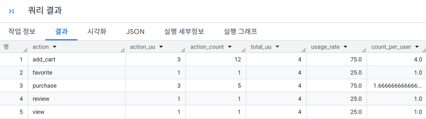

**결과 설명 / 주의점**
- `stats` CTE를 사용하여 전체 유니크 사용자 수를 계산합니다.
- `action_log` 테이블에서 각 액션의 유니크 사용자 수와 전체 액션 수를 계산합니다.
- 사용률과 사용자가 평균적으로 액션을 몇 번이나 사용했는지 계산하여 결과를 출력합니다.
- 주의점: `COUNT(DISTINCT session)`은 유니크 사용자 수를 계산하고, `COUNT(action)`은 전체 액션 수를 계산합니다.

#### 1-1-2 로그인 사용자와 비로그인 사용자를 구분해서 집계하기

**핵심 원리 및 요약**
- `user_id`가 존재하면 `login_status`를 `login`으로, 그렇지 않으면 `guest`로 설정
- `action_log_with_status`라는 CTE를 생성하여 로그인 상태 판별

```sql
-- 로그인 상태를 판별하는 쿼리
WITH action_log_with_status AS (
  SELECT
    session,
    user_id, 
    action,
    CASE
      WHEN COALESCE(user_id, '') <> '' THEN 'login' -- user_id가 NULL 또는 빈 문자가 아닌 경우 'login' 판정
      ELSE 'guest' -- NULL이거나 빈 문자열('')이면 'guest' 판정
    END AS login_status 
  FROM `3rd_week.action_log` 
)
SELECT *
FROM action_log_with_status;
```
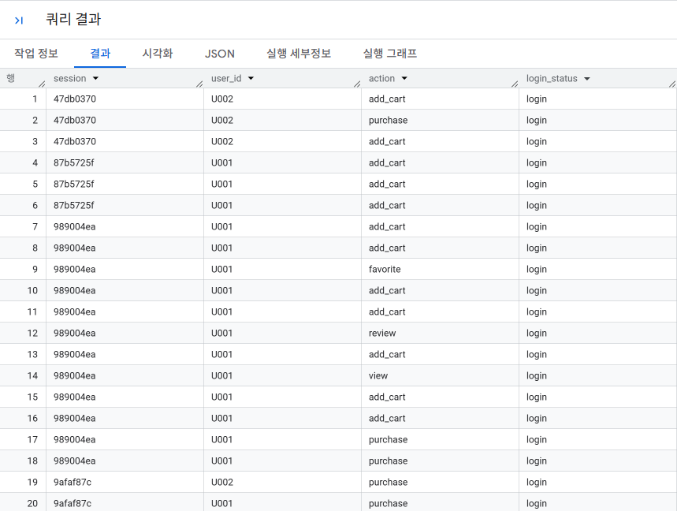

**결과 설명 / 주의점**
- `user_id`가 존재하면 `login_status`는 `login`으로 설정됩니다.
- `user_id`가 없으면 `login_status`는 `guest`로 설정됩니다.
- 결과는 `session`, `user.id`, `action`, `login_status`를 포함합니다.

---

**핵심 원리 및 요약**
- `login_status`를 기반으로 액션 수와 UU(Unique Users: 중복 없이 집계된 사용자 수)를 집계합니다.
- `ROLLUP` 구문을 사용하여 `action`과 `login_status`의 모든 조합을 포함합니다.
- `ROLLUP` 구문이 지원되지 않는 경우 `UNION ALL`을 사용하여 같은 결과를 얻을 수 있습니다.

```sql
-- 로그인 상태에 따라 액션 수 등을 따로 집계하는 쿼리
WITH action_log_with_status AS (
  SELECT
    session,
    user_id, 
    action,
    CASE
      WHEN COALESCE(user_id, '') <> '' THEN 'login'
      ELSE 'guest'
    END AS login_status  
  FROM `3rd_week.action_log` 
)

-- 2. ROLLUP을 통한 계층별 소계/총계 집계
SELECT
  -- ROLLUP에 의해 합산되어 NULL로 표시되는 행을 'all'로 치환
  COALESCE(action, 'all')       AS action,
  COALESCE(login_status, 'all') AS login_status,
  COUNT(DISTINCT session)       AS action_uu,  
  COUNT(1)                      AS action_count 

FROM action_log_with_status  

-- BigQuery 표준 SQL은 ROLLUP(컬럼1, 컬럼2) 문법을 사용
GROUP BY ROLLUP(action, login_status)                                 -- (action, status)별 상세 -> action별 소계 -> 전체 총계 생성
ORDER BY
  action, login_status;
```
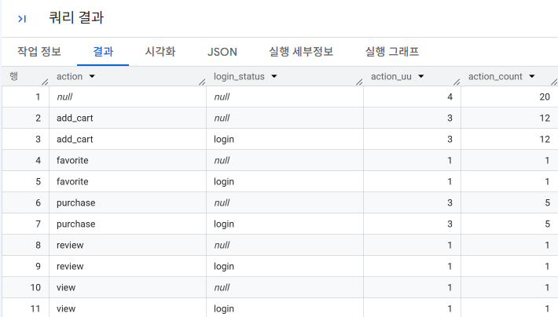

- 로그 정보의 user_id 정보를 기반으로 집계한 데이터이므로, 비로그인 사용자가 로그인하면 
각각의 액션에 1 씩 추가됨. 

**결과 설명 / 주의점**
- `action`과 `login_status`의 모든 조합에 대한 액션 수와 UU를 집계합니다.
- `action`과 `login_status`가 모두 `all`인 경우 전체 데이터를 포함합니다.
- 결과는 `action`, `login_status`, `action_uu`, `action_count`를 포함합니다.

#### 1-1-3 회원과 비회원을 구분해서 집계하기

**핵심 원리 및 요약**
- `user_id`가 존재하면 `login_status`를 `login`으로, 그렇지 않으면 `guest`로 설정합니다.
- `action_log_with_status`라는 CTE를 생성하여 로그인 상태를 판별합니다.
- `member_status`를 추가하여 한 번이라도 로그인한 사용자를 `member`로 설정합니다.

```sql
WITH action_log_with_status AS (
  SELECT
    session,
    user_id,
    action,

    -- [회원 여부(member_status) 판정 로직]
    CASE 
      WHEN COALESCE(
        -- 동일 세션 내에서 시간(stamp) 순서대로 첫 행부터 현재 행까지 user_id의 최댓값을 누적 탐색
        -- (한 번이라도 로그인하여 user_id가 찍혔다면 그 이후 행들에도 해당 user_id가 계속 유지되어 전파됨)
        MAX(user_id) OVER(
          PARTITION BY session 
          ORDER BY stamp 
          ROWS BETWEEN UNBOUNDED PRECEDING AND CURRENT ROW
        ), 
        '' -- 누적된 user_id가 없으면(NULL) 빈 문자열('')로 치환
      ) <> '' THEN 'member' -- 현재 행 시점까지 로그인한 이력이 존재하면 'member'
      ELSE 'none'           -- 아직 로그인한 적이 없다면 'none'
    END AS member_status,

    stamp
  FROM
    `sql-master-507514.3rd_week.action_log`
)
SELECT *
FROM action_log_with_status;
```
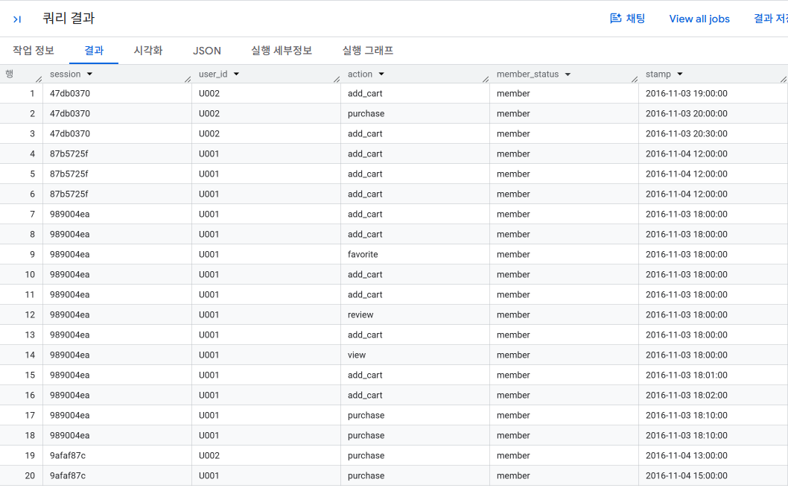

**결과 설명 / 주의점**
- `user_id`가 존재하면 `login_status`는 `login`으로 설정됩니다.
- `user_id`가 없으면 `login_status`는 `guest`로 설정됩니다.
- 한 번이라도 로그인한 사용자를 `member_status`로 설정합니다.
- 결과는 `session`, `user.id`, `action`, `member_status`, `stamp`를 포함합니다.

> 원포인트
```
로그인 하지 않은 상태일 경우, 사용자 ID 컬럼의 값이 빈 문자열 또는 NULL 일 수 있기 때문에, COALESCE 함수를 사용해 빈 문자열로 전환하여 해결 가능

로그인하지 않은 때의 사용자 ID를 빈 문자열로 저장했다면, COUNT(DISTINCT user_id)의 결과에 1이 추가된다. 따라서, COUNT(DISTINCT user_id)를 정확하게 추출하려면 사용자 ID를 NULL로 지정하는 것이 좋다.
```
### 1-2 연령별 구분 집계하기

**핵심 원리 및 요약**
- 연령별 구분을 사용자에 추가하여 다양한 리포트를 만들 수 있음
- 생일을 기반으로 특정 날짜의 나이를 계산하고, 연령별 구분을 계산하여 사용자 정보에 추가
- 나이는 생일과 특정 날짜를 정수로 표현하고, 이 차이를 10,000으로 나누는 방법으로 간단하게 계산 가능

```sql
-- 사용자의 생일을 계산하는 쿼리
WITH mst_users_with_int_birth_date AS (
  SELECT
    *,
    20170101 AS int_specific_date,   -- 특정 날짜(2017년 1월 1일)의 정수 표현
    CAST(REPLACE(SUBSTR(birth_date, 1, 10), '-', '') AS INT64) AS int_birth_date  -- 문자열로 구성된 생년월일을 정수 표현으로 변환 (BigQuery 규격: SUBSTR + CAST AS INT64)
  FROM
    `3rd_week.mst_users`
)
, mst_users_with_age AS (
  SELECT
    *,
    FLOOR((int_specific_date - int_birth_date) / 10000) AS age  -- 특정 날짜(2017년 1월 1일)의 나이
  FROM
    mst_users_with_int_birth_date
)
SELECT
  user_id,
  sex,
  birth_date,
  age
FROM
  mst_users_with_age
;
```
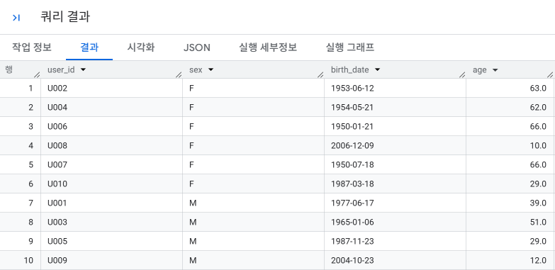

**결과 설명 / 주의점**
- `user_id`가 존재하면 `login_status`는 `'login'`으로 설정됩니다[cite: 3].
- `user_id`가 없거나 빈 문자열이면 `login_status`는 `'guest'`로 설정됩니다[cite: 3].
- 세션 내에서 한 번이라도 로그인한 이력이 있는 행부터는 누적 윈도우 함수를 통해 `member_status`가 `'member'`로 설정됩니다.
- 로그인한 적이 없는 이전 행들은 `member_status`가 `'none'`으로 유지됩니다.
- 결과는 `session`, `user_id`, `action`, `member_status`, `stamp`를 포함합니다.
---
```sql
-- 성별과 연령으로 연령별 구분을 계산하는 쿼리
WITH mst_users_with_int_birth_date AS (
  SELECT
    *,
    20170101 AS int_specific_date,                                              -- 1. 나이 계산의 기준일(2017년 1월 1일)을 8자리 정수(YYYYMMDD)로 지정
    CAST(REPLACE(SUBSTR(birth_date, 1, 10), '-', '') AS INT64) AS int_birth_date -- 2. 생년월일 문자열에서 하이픈(-)을 제거하고 정수형(INT64)으로 변환
  FROM
    `3rd_week.mst_users`
)
, mst_users_with_age AS (
  SELECT
    *,
    -- 3. 기준일 정수에서 생년월일 정수를 뺀 후 10000으로 나누어 내림(FLOOR) 처리 (생일 경과 여부가 완벽히 반영된 만 나이 산출)
    FLOOR((int_specific_date - int_birth_date) / 10000) AS age
  FROM
    mst_users_with_int_birth_date
)
, mst_users_with_category AS (
  SELECT
    user_id, -- 사용자 식별자 ID
    sex,     -- 성별 ('M' 또는 'F')
    age,     -- 위에서 계산된 만 나이

    -- 4. 성별과 연령대 코드를 하나로 연결하여 마케팅 세분화 카테고리(예: M1, F2, C, T 등) 생성
    CONCAT(
      -- 4-1. 성별 접두사 부여: 20세 이상 성인인 경우에만 성별('M'/'F')을 붙이고, 미성년자(20세 미만)는 빈 문자열('') 처리
      CASE
        WHEN 20 <= age THEN sex
        ELSE ''
      END,

      -- 4-2. 연령대 구간 분류 코드 부여 (광고/마케팅 표준 타깃 구분)
      CASE
        WHEN age BETWEEN 4 AND 12  THEN 'C'  -- Child (어린이: 4~12세, 성별 무관 단독 'C')
        WHEN age BETWEEN 13 AND 19 THEN 'T'  -- Teen (청소년: 13~19세, 성별 무관 단독 'T')
        WHEN age BETWEEN 20 AND 34 THEN 'M1' -- 20~34세 청년층 (앞의 성별과 합쳐져 'MM1'/'FM1' 형태 생성)
        WHEN age BETWEEN 35 AND 49 THEN 'M2' -- 35~49세 중년층 (앞의 성별과 합쳐져 'MM2'/'FM2' 형태 생성)
        WHEN age >= 50             THEN 'M3' -- 50세 이상 장년·노년층 (앞의 성별과 합쳐져 'MM3'/'FM3' 형태 생성)
      END
    ) AS category

  FROM
    mst_users_with_age
)
SELECT *
FROM mst_users_with_category;
```
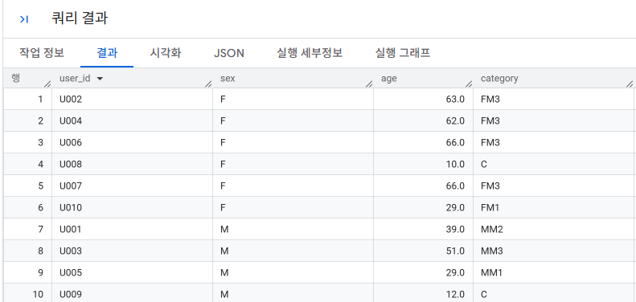

**결과 설명 / 주의점**
- 2017년 1월 1일 기준 만 나이를 계산한 후, 성별(`sex`)과 연령대(`age`)를 조합하여 세분화 카테고리(`category`)를 생성합니다.
- **성인(20세 이상)**: 성별 접두사(`M`/`F`)와 연령 구간 코드가 합쳐져 `MM1`, `FM1`, `MM2`, `FM2`, `MM3`, `FM3` 형태로 부여됩니다.
- **미성년자(20세 미만)**: 성별 구분 없이 어린이(`C`, 4~12세) 또는 청소년(`T`, 13~19세) 단일 코드로만 부여됩니다.
- 만 나이가 **4세 미만(0~3세)**인 영유아는 두 번째 `CASE` 조건식에 정의되어 있지 않아 카테고리가 `NULL`이 되어 `CONCAT`의 결과도 `NULL`이 됩니다.
- `birth_date`가 `NULL`인 데이터가 존재할 경우 나이 및 최종 카테고리 연산 결과가 모두 `NULL`이 되므로 사전 정제가 필요합니다.
- 최종 결과는 `user_id`, `sex`, `age`, `category` 컬럼을 포함합니다.

```sql
-- 연령별 구분의 사람 수를 계산하는 쿼리
WITH mst_users_with_age AS (
  SELECT
    *,
    FLOOR((int_specific_date - int_birth_date) / 10000) AS age
  FROM
    mst_users_with_int_birth_date
)
, mst_users_with_category AS (
  SELECT
    user_id,
    sex,
    age, 
    CONCAT(
      CASE
        WHEN 20 <= age THEN sex
        ELSE ''
      END,
      CASE
        WHEN age BETWEEN 4 AND 12  THEN 'C'
        WHEN age BETWEEN 13 AND 19 THEN 'T'
        WHEN age BETWEEN 20 AND 34 THEN 'M1'
        WHEN age BETWEEN 35 AND 49 THEN 'M2'
        WHEN age >= 50             THEN 'M3'
      END
    ) AS category

  FROM
    mst_users_with_age
)
SELECT
  category,
  COUNT(1) AS user_count
FROM
  mst_users_with_category
GROUP BY
  category;
```
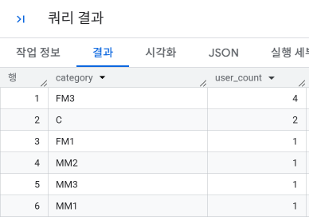

**결과 설명 / 주의점**
- `category` 컬럼은 연령과 성별을 결합한 구분 코드입니다.
- `COUNT(*)`는 각 구분 코드별 사용자 수를 계산합니다.
- `WHERE category IS NOT NULL`로 NULL 값을 제외하여 계산합니다.

### 1-3 연령별 구분의 특징 추출하기

**핵심 원리 및 요약**
- `action_log` 테이블에서 구매 로그만 선택합니다.
- `mst_users_with_category` 테이블과 조인하여 구매한 상품의 카테고리를 집계합니다.
- `GROUP BY`를 사용하여 카테고리별 구매 수를 계산합니다.


```sql
WITH mst_users_with_int_birth_date AS (
  SELECT
    user_id,
    sex,
    birth_date,
    CAST(REPLACE(SUBSTR(birth_date, 1, 10), '-', '') AS INT64) AS int_birth_date
  FROM
    `sql-master-507514.3rd_week.mst_users`
),
mst_users_with_age AS (
  SELECT
    user_id,
    sex,
    birth_date,
    int_birth_date,
    FLOOR((20170101 - int_birth_date) / 10000) AS age
  FROM
    mst_users_with_int_birth_date
),
mst_users_with_category AS (
  SELECT
    user_id,
    sex,
    age,
    CONCAT(
      CASE
        WHEN 20 <= age THEN sex
        ELSE ''
      END,
      CASE
        WHEN age BETWEEN 4 AND 12 THEN 'C'
        WHEN age BETWEEN 13 AND 19 THEN 'T'
        WHEN age BETWEEN 20 AND 34 THEN 'M1'
        WHEN age BETWEEN 35 AND 49 THEN 'M2'
        WHEN age >= 50 THEN 'M3'
      END
    ) AS category
  FROM
    mst_users_with_age
)
SELECT
  p.category AS product_category,
  u.category AS user_category,
  COUNT(*) AS purchase_count
FROM
  `sql-master-507514.3rd_week.action_log` AS p
JOIN
  mst_users_with_category AS u
ON
  p.user_id = u.user_id
WHERE
  action = 'purchase'
GROUP BY
  p.category, u.category
ORDER BY
  p.category, u.category;
```

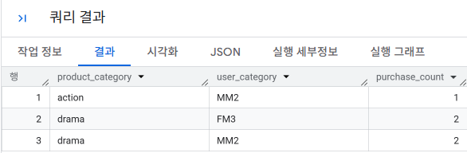

 **결과 설명 / 주의점**
- `product_category`와 `user_category`는 각각 구매한 상품의 카테고리와 사용자의 연령별 구분 코드입니다.
- `COUNT(*)`는 각 카테고리 내에서의 구매 수를 계산합니다.

### 1-4 사용자의 방문 빈도 집계하기

**핵심 원리 및 요약**
- 사용자 ID, 액션, 날짜가 기록되어 있는 `action_log` 테이블에 사용자 ID 별로 날짜에 DISTINCT를 적용하여 사용 일수를 집계
- 구성비와 구성비누계를 계산하여 사용 일수에 따른 사용자 수를 분석

```sql
-- 한 주에 며칠 사용되었는지를 집계하는 쿼리
WITH action_log_with_dt AS (
  SELECT
    user_id,
    action,
    SUBSTR(stamp, 1, 10) AS dt
  FROM
    `sql-master-507514.3rd_week.action_log`
),
action_day_count_per_user AS (
  SELECT
    user_id,
    COUNT(DISTINCT dt) AS action_day_count     -- 해당 기간 내 사용자가 실제로 활동(접속/액션)한 고유 일수 집계
  FROM
  FROM
    action_log_with_dt
  WHERE
    dt BETWEEN '2016-11-01' AND '2016-11-07'
  GROUP BY
    user_id
)
SELECT
  action_day_count,
  COUNT(DISTINCT user_id) AS user_count    -- 해당 활동 일수 구간에 속하는 고유 사용자 수 집계
FROM
  action_day_count_per_user
GROUP BY
  action_day_count
ORDER BY
  action_day_count;
```
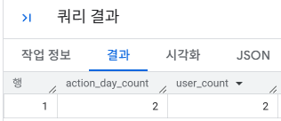

```sql
WITH
-- 1. 타임스탬프에서 일자(YYYY-MM-DD) 추출
action_log_with_dt AS (
  SELECT
    user_id,
    action,
    SUBSTR(stamp, 1, 10) AS dt
  FROM
    `3rd_week.action_log`
),

-- 2. 대상 기간(11-01 ~ 11-07) 동안 각 사용자별 활동 일수(방문 빈도) 집계
action_day_count_per_user AS (
  SELECT
    user_id,
    COUNT(DISTINCT dt) AS action_day_count
  FROM
    action_log_with_dt
  WHERE
    dt BETWEEN '2016-11-01' AND '2016-11-07'
  GROUP BY
    user_id
)

-- 3. 활동 일수별 유저 수, 구성비(%), 구성비 누계(%) 산출
SELECT
  action_day_count,                                      -- 활동 일수 (계급)
  COUNT(DISTINCT user_id) AS user_count,                 -- 해당 활동 일수에 속한 고유 사용자 수

  -- 구성비: 100.0 * <해당 일수 유저 수> / <전체 유저 수>
  100.0
  * COUNT(DISTINCT user_id)
  / SUM(COUNT(DISTINCT user_id)) OVER() AS composition_ratio,

  -- 구성비 누계: 100.0 * <1일부터 현재 일수까지 누적 유저 수> / <전체 유저 수>
  100.0
  * SUM(COUNT(DISTINCT user_id)) OVER(
      ORDER BY action_day_count
      ROWS BETWEEN UNBOUNDED PRECEDING AND CURRENT ROW
    )
  / SUM(COUNT(DISTINCT user_id)) OVER() AS cumulative_ratio

FROM
  action_day_count_per_user
GROUP BY
  action_day_count
ORDER BY
  action_day_count;
```
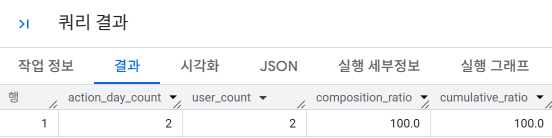

**결과 설명 / 주의점**
- 구성비는 각 사용 일수별 사용자 수를 전체 사용자 수에 대한 비율로 나타냅니다.
- 구성비누계는 각 사용 일수별 사용자 수를 전체 사용자 수에 대한 누적 비율로 나타냅니다.
- 결과는 사용 일수와 해당 사용 일수에 따른 사용자 수를 정렬하여 출력됩니다.
### 1-5 벤 다이어그램으로 사용자 액션 집계하기
#### 1-5-1 사용자들의 액션 플래그를 집계하는 쿼리
**핵심 원리 및 요약**
- 사용자 단위로 로그를 집약하고 purchase, review, favorite 3개의 액션을 행한 로그가 존재하는지를 확인합니다.
- SIGN 함수와 SUM 함수를 사용하여 각 액션에 대한 플래그를 부여하고, 이를 사용하여 벤다이어그램 데이터를 생성합니다.

```sql
-- 사용자들의 액션 플래그를 집계하는 쿼리
WITH user_action_flag AS (
  SELECT
    user_id,
    SIGN(SUM(CASE WHEN action = 'purchase' THEN 1 ELSE 0 END)) AS has_purchase, -- 구매(purchase) 액션 이력 유무 플래그 (1회 이상: 1, 0회: 0)
    SIGN(SUM(CASE WHEN action = 'review'   THEN 1 ELSE 0 END)) AS has_review,   -- 리뷰(review) 작성 이력 유무 플래그 (1회 이상: 1, 0회: 0)
    SIGN(SUM(CASE WHEN action = 'favorite' THEN 1 ELSE 0 END)) AS has_favorite -- 찜/즐겨찾기(favorite) 이력 유무 플래그 (1회 이상: 1, 0회: 0)
  FROM
    `sql-master-507514.3rd_week.action_log`
  GROUP BY
    user_id
)
SELECT *
FROM user_action_flag;
```
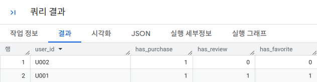

**결과 설명 / 주의점**
- `has_purchase`, `has_review`, `has_favorite` 컬럼은 각각 구매, 리뷰, 즐겨찾기 등록 액션을 실행했다면 1, 실행하지 않았다면 0을 나타냅니다.
- 결과는 사용자 ID와 각 액션에 대한 플래그가 포함되어 있습니다.

#### 1-5-2 CUBE 구문을 사용해 모든 액션 조합에 대한 사용자 수 계산하기
**핵심 원리 및 요약**
- CUBE 구문을 사용하여 모든 액션 조합에 대한 사용자 수를 쉽게 계산합니다.
- CUBE 구문은 모든 가능한 조합을 자동으로 생성하여 사용자 수를 계산합니다.

```sql
WITH user_action_flag AS (
  SELECT
    user_id,
    -- 1. SIGN() + SUM(CASE...): 조건 일치 횟수가 1 이상(양수)이면 1, 0이면 0으로 유무 플래그 생성
    SIGN(SUM(CASE WHEN action = 'purchase' THEN 1 ELSE 0 END)) AS has_purchase, -- 구매 이력 유무 플래그 (있음: 1, 없음: 0)
    SIGN(SUM(CASE WHEN action = 'review'   THEN 1 ELSE 0 END)) AS has_review,   -- 리뷰 이력 유무 플래그 (있음: 1, 없음: 0)
    SIGN(SUM(CASE WHEN action = 'favorite' THEN 1 ELSE 0 END)) AS has_favorite  -- 찜 이력 유무 플래그 (있음: 1, 없음: 0)
  FROM
    `sql-master-507514.3rd_week.action_log`
  GROUP BY
    user_id
)
,action_venn_diagram AS (
  SELECT
    has_purchase,
    has_review,
    has_favorite,
    COUNT(user_id) AS users
  FROM
    user_action_flag
  GROUP BY
    -- 2. CUBE(): 지정한 컬럼들로 만들 수 있는 '모든 조합(2^3 = 8가지)' 및 소계/총계를 한 번에 집계
    --    (집계에서 제외된 컬럼 자리는 NULL로 채워져 벤다이어그램의 부분집합 역할을 함)
    CUBE(has_purchase, has_review, has_favorite)
)
SELECT *
FROM action_venn_diagram
ORDER BY
  has_purchase, has_review, has_favorite;
```
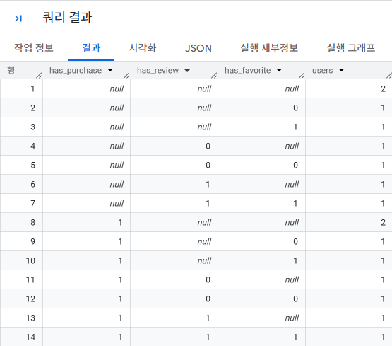

**결과 설명 / 주의점**
- `has_purchase`, `has_review`, `has_favorite` 컬럼의 값이 없는(NULL) 레코드는 해당 액션을 했는지 안 했는지 모르는 경우를 의미합니다.
- 결과는 모든 가능한 액션 조합에 대한 사용자 수가 포함되어 있습니다.

#### 1-5-3 CUBE 구문을 사용하지 않고 표준 SQL 구문만으로 작성한 쿼리
**핵심 원리 및 요약**
- CUBE 구문을 사용하지 않고 표준 SQL 구문만으로 모든 액션 조합을 개별적으로 구하고 UNION ALL로 결합하여 사용자 수를 계산합니다.

```sql
WITH user_action_flag AS (
  SELECT
    user_id,
    SIGN(SUM(CASE WHEN action = 'purchase' THEN 1 ELSE 0 END)) AS has_purchase,
    SIGN(SUM(CASE WHEN action = 'review'   THEN 1 ELSE 0 END)) AS has_review,
    SIGN(SUM(CASE WHEN action = 'favorite' THEN 1 ELSE 0 END)) AS has_favorite
  FROM
    `sql-master-507514.3rd_week.action_log`
  GROUP BY
    user_id
)
,action_venn_diagram AS (
  -- 1. 3개의 액션을 모두 조합한 경우 (모든 세부 그룹)
  SELECT has_purchase, has_review, has_favorite, COUNT(user_id) AS users
  FROM user_action_flag
  GROUP BY has_purchase, has_review, has_favorite

  -- 2. 2개 액션 기준 소계 (1개 컬럼을 NULL로 제외)
  UNION ALL
  SELECT NULL AS has_purchase, has_review, has_favorite, COUNT(user_id) AS users
  FROM user_action_flag
  GROUP BY has_review, has_favorite
  UNION ALL
  SELECT has_purchase, NULL AS has_review, has_favorite, COUNT(user_id) AS users
  FROM user_action_flag
  GROUP BY has_purchase, has_favorite
  UNION ALL
  SELECT has_purchase, has_review, NULL AS has_favorite, COUNT(user_id) AS users
  FROM user_action_flag
  GROUP BY has_purchase, has_review

  -- 3. 1개 액션 기준 소계 (2개 컬럼을 NULL로 제외)
  UNION ALL
  SELECT NULL AS has_purchase, NULL AS has_review, has_favorite, COUNT(user_id) AS users
  FROM user_action_flag
  GROUP BY has_favorite
  UNION ALL
  SELECT has_purchase, NULL AS has_review, NULL AS has_favorite, COUNT(user_id) AS users
  FROM user_action_flag
  GROUP BY has_purchase
  UNION ALL
  SELECT NULL AS has_purchase, has_review, NULL AS has_favorite, COUNT(user_id) AS users
  FROM user_action_flag
  GROUP BY has_review

  -- 4. 액션과 관계없이 모든 사용자 총계 (GROUP BY 제거)
  UNION ALL
  SELECT NULL AS has_purchase, NULL AS has_review, NULL AS has_favorite, COUNT(user_id) AS users
  FROM user_action_flag
)
SELECT *
FROM action_venn_diagram
ORDER BY
  has_purchase, has_review, has_favorite;
```
**결과 설명 / 주의점**
- 결과는 모든 가능한 액션 조합에 대한 사용자 수가 포함되어 있습니다.
- NULL 값은 해당 액션을 했는지 안 했는지 모르는 경우를 의미합니다.
- UNION ALL을 많이 사용하므로 성능이 좋지 않습니다.

#### 1-5-4 유사적으로 NULL을 포함한 레코드를 추가해서 CUBE 구문과 같은 결과를 얻는 쿼리
**핵심 원리 및 요약**
- CROSS JOIN과 UNNEST 함수를 사용하여 CUBE 구문과 유사한 결과를 얻습니다.

```sql
WITH user_action_flag AS (
  SELECT
    user_id,
    SIGN(SUM(CASE WHEN action = 'purchase' THEN 1 ELSE 0 END)) AS has_purchase,
    SIGN(SUM(CASE WHEN action = 'review'   THEN 1 ELSE 0 END)) AS has_review,
    SIGN(SUM(CASE WHEN action = 'favorite' THEN 1 ELSE 0 END)) AS has_favorite
  FROM
    `sql-master-507514.3rd_week.action_log`
  GROUP BY
    user_id
)
, action_venn_diagram AS (
  SELECT
    mod_has_purchase AS has_purchase,
    mod_has_review AS has_review,
    mod_has_favorite AS has_favorite,
    COUNT(1) AS users                                          -- 조합별(소계/총계 및 세부 그룹) 사용자 수 집계
  FROM
    user_action_flag
  -- 각 플래그 값과 NULL을 담은 2개 요소의 배열을 행으로 풀어(UNNEST) 교차 결합(CROSS JOIN)
  CROSS JOIN UNNEST([has_purchase, NULL]) AS mod_has_purchase -- 1. 구매 플래그를 원래 값과 NULL(미포함) 2가지 행으로 복제·전개
  CROSS JOIN UNNEST([has_review,   NULL]) AS mod_has_review   -- 2. 리뷰 플래그를 원래 값과 NULL(미포함) 2가지 행으로 복제·전개
  CROSS JOIN UNNEST([has_favorite, NULL]) AS mod_has_favorite -- 3. 찜 플래그를 원래 값과 NULL(미포함) 2가지 행으로 복제·전개
  GROUP BY
    mod_has_purchase, mod_has_review, mod_has_favorite
)
SELECT *
FROM action_venn_diagram
ORDER BY
  has_purchase, has_review, has_favorite
;
```

**결과 설명 / 주의점**
- CROSS JOIN과 UNNEST 함수를 사용하여 CUBE 구문과 유사한 결과를 얻습니다.

- `CROSS JOIN UNNEST([col, NULL])` 동작 원리

---
1. 배열 생성 및 `UNNEST`를 통한 행 복제
* `[has_purchase, NULL]`은 **"원래 값"**과 **"NULL"** 2개의 요소를 가진 1차원 배열입니다.
* 이를 `UNNEST`하면 기존 1개의 행이 **원래 값 행 1개**와 **NULL 행 1개**로 총 2개의 행으로 분리되어 세로로 펼쳐집니다.

---
2. 3개 컬럼의 `CROSS JOIN`
* 3개 컬럼(`has_purchase`, `has_review`, `has_favorite`)에 대해 각각 `[값, NULL]` 2개 행을 교차 결합(CROSS JOIN)합니다.
* 유저 1명의 데이터가 $2 \times 2 \times 2 = 8$개의 복제 행으로 확장됩니다.
* 이때 `NULL`은 해당 축(액션)을 집계에서 제외하겠다는 의미를 가지므로, 벤다이어그램의 모든 부분집합 형태가 만들어집니다.
  * 3개 모두 원래 값: 3개 액션 모두 고려한 **세부 조합**
  * 1개만 NULL: 특정 1개 액션을 제외한 **2개 액션 교차 소계**
  * 2개가 NULL: 단 1개 액션만 고려한 **1개 액션 소계**
  * 3개 모두 NULL: 모든 액션을 배제한 **전체 총계(Grand Total)**

---
 3. `GROUP BY`를 통한 다차원 동시 집계
* 복제된 8가지 형태의 행들을 기준으로 `GROUP BY`를 수행하면 각 그룹별 유니크 사용자 수(`COUNT(1)`)가 계산됩니다.
* 결과적으로 `CUBE` 구문이나 복잡한 8번의 `UNION ALL` 없이도 **모든 세부 그룹, 2개 교차 소계, 1개 단독 소계, 전체 총계**를 한 번의 쿼리로 산출합니다.

#### 1-5-5 벤 다이어그램을 위한 데이터 가공

**핵심 원리 및 요약**
- 각 액션 구조에서의 사용자 수와 구성 비율도 함께 구합니다.

```sql
WITH user_action_flag AS (
  SELECT
    user_id,
    SIGN(SUM(CASE WHEN action = 'purchase' THEN 1 ELSE 0 END)) AS has_purchase,
    SIGN(SUM(CASE WHEN action = 'review'   THEN 1 ELSE 0 END)) AS has_review,
    SIGN(SUM(CASE WHEN action = 'favorite' THEN 1 ELSE 0 END)) AS has_favorite
  FROM
    `sql-master-507514.3rd_week.action_log`
  GROUP BY
    user_id
)
, action_venn_diagram AS (
  SELECT
    mod_has_purchase AS has_purchase,
    mod_has_review   AS has_review,
    mod_has_favorite AS has_favorite,
    COUNT(1)         AS users
  FROM
    user_action_flag
  CROSS JOIN UNNEST([has_purchase, NULL]) AS mod_has_purchase
  CROSS JOIN UNNEST([has_review,   NULL]) AS mod_has_review
  CROSS JOIN UNNEST([has_favorite, NULL]) AS mod_has_favorite
  GROUP BY
    mod_has_purchase,
    mod_has_review,
    mod_has_favorite
)
SELECT
  -- 0, 1, NULL 플래그를 문자열 라벨로 가공
  CASE has_purchase
    WHEN 1 THEN 'purchase'
    WHEN 0 THEN 'not purchase'
    ELSE 'any'
  END AS has_purchase,

  CASE has_review
    WHEN 1 THEN 'review'
    WHEN 0 THEN 'not review'
    ELSE 'any'
  END AS has_review,

  CASE has_favorite
    WHEN 1 THEN 'favorite'
    WHEN 0 THEN 'not favorite'
    ELSE 'any'
  END AS has_favorite,

  users,

  -- 전체 사용자 수를 기반으로 비율(%) 산출 (모든 축이 NULL인 행이 전체 총계)
  100.0 * users
  / NULLIF(
      SUM(CASE WHEN has_purchase IS NULL
                AND has_review   IS NULL
                AND has_favorite IS NULL
               THEN users ELSE 0 END) OVER(),
      0
    ) AS ratio

FROM
  action_venn_diagram
ORDER BY
  has_purchase,
  has_review,
  has_favorite
;
```
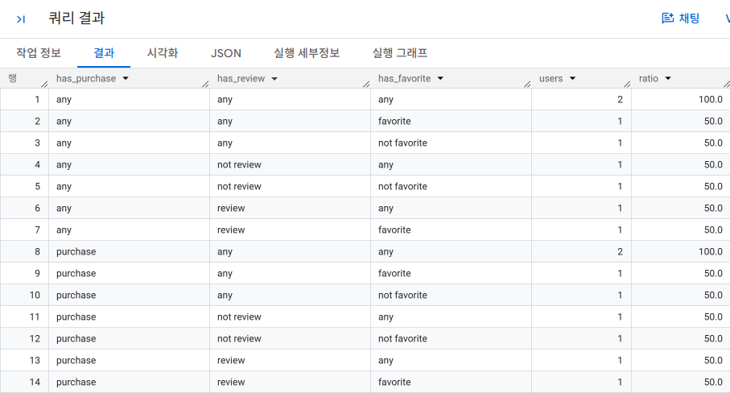

**결과 설명 / 주의점**

1. 결과 설명
* **벤다이어그램 세그먼트 집계**: 3가지 주요 액션(`purchase`, `review`, `favorite`)의 수행 여부에 따른 유저 분포를 벤다이어그램 형태로 분해하여 집계합니다.
* **출력 라벨 의미**:
  * `'purchase'` / `'review'` / `'favorite'`: 해당 액션을 1회 이상 수행한 사용자
  * `'not purchase'` / `'not review'` / `'not favorite'`: 해당 액션을 한 번도 수행하지 않은 사용자
  * `'any'`: 해당 액션 수행 여부와 관계없이 집계에서 축을 제외(소계/총계 생성)한 상태
* **출력 행의 구성 (총 8개 집계 레벨)**:
  * 세 컬럼 모두 `purchase`/`not ...`인 경우: 각 액션의 유무를 모두 고려한 **최세부 조합 집계**
  * 하나의 컬럼이 `any`인 경우: 해당 축을 제외한 **2개 액션 기준 교차 소계**
  * 두 컬럼이 `any`인 경우: 단 1개 축만 기준으로 삼은 **1개 액션 단독 소계**
  * 세 컬럼 모두 `any`인 경우: 액션 구분 없이 대상 기간 동안 활동한 **전체 사용자 총계(Grand Total)**
* **비율(`ratio`) 산출**: Window 함수를 사용해 전체 총계 행(`any`, `any`, `any`)의 `users` 수를 분모로 삼아 각 조합 그룹이 전체 유저 중 몇 %를 차지하는지 백분율로 계산합니다.

---
2. 작성 및 분석 시 주의점
* **전체 사용자 모수의 정의 (활동 유저 기준)**:
  * `FROM` 절에서 `action_log` 테이블을 직접 참조하므로, 전체 총계(`any`, `any`, `any`)는 서비스의 전체 가입 유저가 아닌 **"해당 로그 테이블에 1회라도 기록이 있는 활동 유저"**만을 모수로 집계합니다.
  * 가입 후 아무런 행동도 하지 않은 완전 미활동 유저까지 포함하려면 회원 마스터 테이블(`mst_users`)을 기준으로 `LEFT JOIN`해야 합니다.
* **행 폭발(Cartesian Product)과 리소스 비용**:
  * `CROSS JOIN UNNEST([col, NULL])`을 컬럼 3개에 적용하면 각 사용자당 행 수가 $2^3 = 8$배로 늘어납니다.
  * 데이터 양이 수천만~수억 건 이상인 대규모 테이블에서는 조인 시점에 데이터가 급격히 불어나 쿼리 비용 증가나 메모리 초과가 발생할 수 있으므로, 먼저 유저 단위로 집약(`GROUP BY user_id`)된 CTE 크기를 확인하고 적용하는 것이 안전합니다.
* **합계가 100%를 초과하는 구조**:
  * 소계 및 총계 행들이 세부 조합 행들과 한 결과셋에 공존하므로, 결과 테이블 전체의 `ratio`를 단순 `SUM()`하면 당연히 100%를 훨씬 초과합니다.
  * 데이터 시각화나 리포트 작성 시 **세부 조합 8개만 따로 떼어 보거나**, 특정 **소계 레벨만 필터링**하여 활용해야 중복 집계를 방지할 수 있습니다.
* **Window 함수 분모 처리(`NULLIF`)**:
  * 비율 계산 시 `NULLIF(..., 0)` 처리가 되어 있어 모수가 0인 경우 발생할 수 있는 0 나누기 오류(`division-by-zero`)를 방지하고 `NULL`을 반환하도록 방어되어 있습니다.

### 1-6 Decile 분석을 사용해 사용자를 10단계 그룹으로 나누기

**Decile 분석이란?**
1. 사용자를 구매 금액이 많은 순으로 정렬합니다.
2. 정렬된 사용자 상위부터 10%p씩 그룹을 할당합니다.
3. 각 그룹의 구매 금액 합계를 집계합니다.
4. 전체 구매 금액에 대해 각 Decile의 구매 금액 비율(구성비)를 계산합니다.
5. 상위에서 누적으로 어느 정도의 비율을 차지하는지 구성비누계를 집계합니다.

#### 1-6-1 구매액이 많은 순서로 사용자 그룹을 10등분하는 쿼리

```sql
WITH user_purchase_amount AS (       -- 사용자를 구매 금액이 많은 순서로 정렬
  SELECT 
    user.id,
    SUM(amount) AS purchase_amount 
  FROM
    `sql-master-507514.3rd_week.action_log`
  WHERE 
    action = 'purchase'
  GROUP BY 
    user.id 
),
users_with_decile AS (              -- 정렬된 사용자의 상위에서 10%씩 Decile1부터 Decile10까지의 그룹을 할당
  SELECT
    user.id,
    purchase_amount,
    NTILE(10) OVER (ORDER BY purchase_amount DESC) AS decile 
  FROM
    user_purchase_amount
)
SELECT *
FROM users_with_decile
```
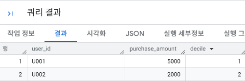

**결과 설명 / 주의점**
- `NTILE(10)` 함수를 사용하여 사용자를 10개의 그룹으로 분할합니다.
- `ORDER BY purchase_amount DESC`를 사용하여 구매 금액이 많은 순서로 정렬합니다.
- 결과는 각 사용자의 ID, 구매 금액, 그리고 해당 사용자가 속한 Decile 그룹을 보여줍니다.

#### 1-6-2 10 분할한 각 Decile들을 집계한 뒤, 구성비와 구성비 누계 계산
**핵심 원리 및 요약**
- 각 그룹의 합계, 평균 구매 금액, 전체 구매 금액 등의 집계를 계산합니다.
- GROUP BY로 Decile들을 집계하고, 집계 함수와 윈도 함수를 조합해서 한 번에 계산합니다.
```sql
WITH user_purchase_amount AS (
  SELECT 
    user_id,
    SUM(amount) AS purchase_amount 
  FROM
    `sql-master-507514.3rd_week.action_log`
  WHERE 
    action = 'purchase'
  GROUP BY 
    user_id 
),
users_with_decile AS ( 
  SELECT
    user_id,
    purchase_amount,
    NTILE(10) OVER (ORDER BY purchase_amount DESC) AS decile 
  FROM
    user_purchase_amount
),
decile_with_purchase_amount AS (
  SELECT
    decile,
    SUM(purchase_amount) AS amount,                                 -- 1. 각 그룹의 총 구매 금액 합계
    AVG(purchase_amount) AS avg_amount,                             -- 2. 각 그룹 내 1인당 평균 구매 금액
    SUM(SUM(purchase_amount)) OVER (ORDER BY decile) AS cumulative_amount, -- 3. Decile 누적 구매 금액
    SUM(SUM(purchase_amount)) OVER () AS total_amount               -- 4. 모든 사용자의 전체 총 구매 금액 (구성비율 계산 시 분모로 활용)
  FROM
    users_with_decile
  GROUP BY
    decile
)
SELECT
  decile,
  amount,
  avg_amount,
  cumulative_amount,
  total_amount,
  100.0*amount/total_amount AS total_ratio,  -- 구성비 계산
  100.0*cumulative_amount/total_amount AS cumulative_ratio  -- 구성비누계 계산
FROM
  decile_with_purchase_amount
ORDER BY
  decile
;
```
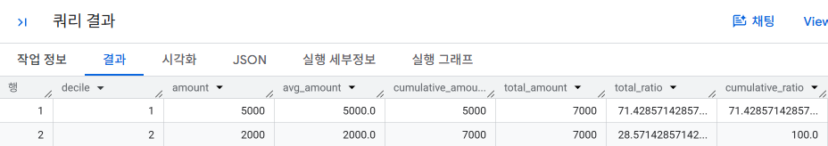

### 1-7 RFM 분석으로 사용자를 3가지 관점의 그룹으로 나누기

- Decile 분석은 분석 기간에 따라 분석 결과가 달라질 수 있습니다.

#### 1-7-1 RFM 분석의 3가지 지표 집계하기
**핵심 원리 및 요약** 
- RFM 분석을 사용하여 사용자를 3가지 관점의 그룹으로 나눕니다.
- Recency: 최근 구매일
- Frequency: 구매 횟수
- Monetary: 구매 금액 합계

```sql
-- 사용자별로 RFM을 집계하는 쿼리
WITH
purchase_log AS (
  SELECT
    user_id,
    amount,    
    SUBSTR(stamp, 1, 10) AS dt   -- SUBSTR로 날짜 부분(YYYY-MM-DD) 10자리 추출
  FROM
    `sql-master-507514.3rd_week.action_log`
  WHERE
    action = 'purchase'
)
, user_rfm AS (
  SELECT
    user_id,
    MAX(dt) AS recent_date,
    DATE_DIFF(CURRENT_DATE(), DATE(TIMESTAMP(MAX(dt))), DAY) AS recency,  -- DATE_DIFF(종료일, 시작일, DAY)를 사용하여 오늘 기준 경과일 수(Recency) 계산
    COUNT(dt) AS frequency,
    SUM(amount) AS monetary
  FROM
    purchase_log
  GROUP BY
    user_id
)
SELECT *
FROM
  user_rfm
;
```
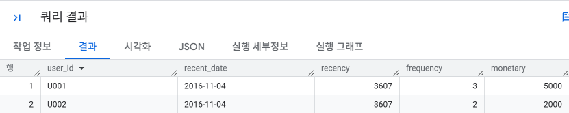

**결과 설명 / 주의점**
- RFM 분석을 통해 사용자를 3가지 관점의 그룹으로 나눌 수 있습니다.
- Recency는 최근 구매일을, Frequency는 구매 횟수를, Monetary는 구매 금액 합계를 나타냅니다.
- RFM 분석은 Decile 분석보다도 자세하게 사용자를 그룹으로 나눌 수 있습니다.

#### 1-7-2 RFM 랭크 정의하기
**핵심 원리 및 요약** 
- RFM 분석에서는 3개의 지표(R,F,M)를 각각 5개의 그룹(랭크)으로 나누는 것이 일반적입니다.
- $125(=5*5*5)$ 개의 그룹으로 사용자를 나눠 파악할 수 있습니다.
```sql
-- 사용자들의 RFM 랭크를 계산하는 쿼리
WITH purchase_log AS (
  SELECT
    user_id,
    amount,
    SUBSTR(stamp, 1, 10) AS dt
  FROM
    `sql-master-507514.3rd_week.action_log`
  WHERE
    action = 'purchase'
)
, user_rfm AS (
  SELECT
    user_id,
    MAX(dt) AS recent_date,
    DATE_DIFF(CURRENT_DATE(), DATE(TIMESTAMP(MAX(dt))), DAY) AS recency,
    COUNT(dt) AS frequency,
    SUM(amount) AS monetary
  FROM
    purchase_log
  GROUP BY
    user_id
)
, user_rfm_rank AS (
  SELECT
    user_id,
    recent_date,
    recency,
    frequency,
    monetary,

    -- R (Recency) 랭크 부여: 최근성 (경과일 수가 짧을수록 높은 점수)
    CASE
      WHEN recency < 14 THEN 5
      WHEN recency < 28 THEN 4
      WHEN recency < 60 THEN 3
      WHEN recency < 90 THEN 2
      ELSE 1
    END AS r,

    -- F (Frequency) 랭크 부여: 빈도 (구매 횟수가 많을수록 높은 점수)
    CASE
      WHEN 20 <= frequency THEN 5
      WHEN 10 <= frequency THEN 4
      WHEN  5 <= frequency THEN 3
      WHEN  2 <= frequency THEN 2
      WHEN  1  = frequency THEN 1
    END AS f,

    -- M (Monetary) 랭크 부여: 구매 금액 (누적 구매액이 클수록 높은 점수)
    CASE
      WHEN 300000 <= monetary THEN 5
      WHEN 100000 <= monetary THEN 4
      WHEN  30000 <= monetary THEN 3
      WHEN   5000 <= monetary THEN 2
      ELSE 1
    END AS m
  FROM
    user_rfm
)
SELECT *
FROM
  user_rfm_rank
;
```
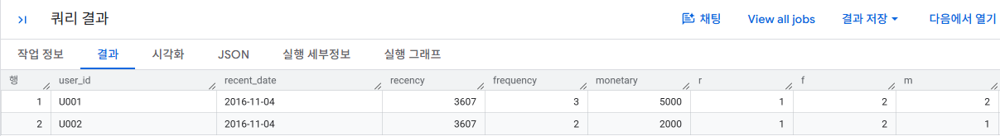

**결과 설명 / 주의점**
- `user_rfm_rank` 테이블에는 각 사용자의 RFM 랭크가 포함됩니다.
- `r`, `f`, `m` 각각은 RFM 점수에 따라 1부터 5까지의 랭크입니다.
- 랭크는 각 지표의 최대값을 기준으로 설정됩니다.

#### 1-7-3 RFM 랭크별 사용자 수 확인

**핵심 원리 및 요약**
- RFM 분석의 결과를 바탕으로 각 RFM 랭크별 사용자 수를 확인합니다.
- 이 코드는 RFM 랭크별 사용자 수를 계산하고, 각 랭크의 사용자 수를 출력합니다.

```sql
-- 각 그룹의 사람 수를 확인하는 쿼리
WITH purchase_log AS (
  SELECT
    user_id,
    amount,
    SUBSTR(stamp, 1, 10) AS dt
  FROM
    `sql-master-507514.3rd_week.action_log`
  WHERE
    action = 'purchase'
)
, user_rfm AS (
  SELECT
    user_id,
    MAX(dt) AS recent_date,
    DATE_DIFF(CURRENT_DATE(), DATE(TIMESTAMP(MAX(dt))), DAY) AS recency,
    COUNT(dt) AS frequency,
    SUM(amount) AS monetary
  FROM
    purchase_log
  GROUP BY
    user_id
)
, user_rfm_rank AS (
  SELECT
    user_id,
    recent_date,
    recency,
    frequency,
    monetary,
    CASE
      WHEN recency < 14 THEN 5
      WHEN recency < 28 THEN 4
      WHEN recency < 60 THEN 3
      WHEN recency < 90 THEN 2
      ELSE 1
    END AS r,
    CASE
      WHEN 20 <= frequency THEN 5
      WHEN 10 <= frequency THEN 4
      WHEN  5 <= frequency THEN 3
      WHEN  2 <= frequency THEN 2
      WHEN  1  = frequency THEN 1
    END AS f,
    CASE
      WHEN 300000 <= monetary THEN 5
      WHEN 100000 <= monetary THEN 4
      WHEN  30000 <= monetary THEN 3
      WHEN   5000 <= monetary THEN 2
      ELSE 1
    END AS m
  FROM
    user_rfm
)
-- 1~5까지의 마스터 인덱스 테이블 생성 (BigQuery: UNNEST 활용)
, mst_rfm_index AS (
  SELECT rfm_index
  FROM UNNEST([1, 2, 3, 4, 5]) AS rfm_index
)
, rfm_flag AS (
  SELECT
    m.rfm_index,
    CASE WHEN m.rfm_index = r.r THEN 1 ELSE 0 END AS r_flag,
    CASE WHEN m.rfm_index = r.f THEN 1 ELSE 0 END AS f_flag,
    CASE WHEN m.rfm_index = r.m THEN 1 ELSE 0 END AS m_flag
  FROM
    mst_rfm_index AS m
  CROSS JOIN
    user_rfm_rank AS r
)
SELECT
  rfm_index,
  SUM(r_flag) AS r,
  SUM(f_flag) AS f,
  SUM(m_flag) AS m
FROM
  rfm_flag
GROUP BY
  rfm_index
ORDER BY
  rfm_index DESC
;
```
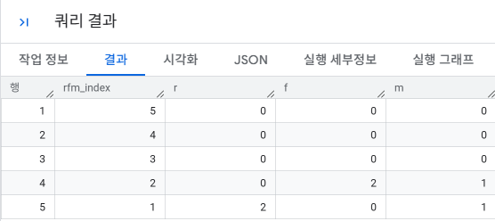

**결과 설명 / 주의점**
- `mst_rfm_index` 테이블에는 1부터 5까지의 숫자가 포함됩니다.
- `rfm_flag` 테이블에는 각 RFM 랭크와 해당 랭크에 해당하는 사용자 수가 포함됩니다.
- 결과는 RFM 랭크별 사용자 수를 출력하며, 랭크가 높을수록 사용자 수가 많습니다.

- RFM 분석 고객 그룹
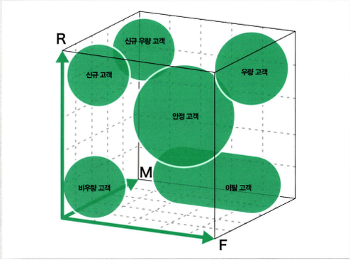

#### 1-7-4 사용자를 1차원으로 구분하기

| 구분 | 세부 R, F, M 조합별 집계 | 종합 랭크(합산 점수)별 집계 |
| :--- | :--- | :--- |
| **핵심 원리 및 요약** | • 각 고객의 R, F, M 3가지 개별 랭크(1~5점)를 합산하여 `total_rank`를 구하되, 그룹화는 개별 지표 단위로 수행<br>• 같은 총점이라도 어떤 지표(R, F, M)의 기여도로 완성되었는지 세부 구성을 보존 | • 개별 지표(R, F, M)의 분기를 모두 걷어내고, 최종 합산 점수(`total_rank = r + f + m`) 하나만으로 최종 그룹화<br>• 전체 고객 풀(Pool)이 몇 점대 구간에 밀집되어 있는지 피라미드형 분포를 단일 테이블로 요약 |
| **결과 설명 및 주의점** | • **결과 설명**: 동일한 총점(예: 12점) 내부에서 `(5, 4, 3)`, `(4, 4, 4)`, `(5, 5, 2)` 등 실제 유저 세부 패턴 분포 확인 가능<br>• **주의점**: 조합 수가 방대하여 한눈에 전체 규모를 요약하기 어려우며, 데이터가 적으면 상당수 조합의 행이 누락되어 빈 상태로 출력됨 | • **결과 설명**: 세부 조합과 관계없이 총점 기준으로만 묶어 유저 피라미드 구조(고득점층 vs 저득점층 규모)를 즉시 파악 가능<br>• **주의점**: 같은 10점이라도 '최근 구매가 좋아 10점'인지 '구매액이 커서 10점'인지 원인 진단이 불가능하여 정밀 타깃팅 전 1차 대시보드용으로 적합 |
| **핵심 목적** | R, F, M의 **각 세부 점수 조합별** 정밀 유저 수 파악 | 세부 점수와 무관하게 **최종 합산 점수(`total_rank`)별** 거시적 유저 분포 파악 |
| **GROUP BY 기준** | `GROUP BY r, f, m` | `GROUP BY total_rank` |
| **출력 컬럼** | `total_rank`, `r`, `f`, `m`, `count` | `total_rank`, `count` |
| **결과 행 수** | 최대 $5 \times 5 \times 5 = \mathbf{125}$**개 행** (실제 데이터에 등장한 고유 조합 수만큼 출력) | 총점 최솟값 3점(1+1+1) ~ 최댓값 15점(5+5+5) 범위인 **최대 13개 행** |


#### 1-7-4-1  세부 R, F, M 조합별 집계
```sql
WITH purchase_log AS (
  SELECT
    user_id,
    amount,
    SUBSTR(stamp, 1, 10) AS dt
  FROM
    `sql-master-507514.3rd_week.action_log`
  WHERE
    action = 'purchase'
)
, user_rfm AS (
  SELECT
    user_id,
    MAX(dt) AS recent_date,
    DATE_DIFF(CURRENT_DATE(), DATE(TIMESTAMP(MAX(dt))), DAY) AS recency,
    COUNT(dt) AS frequency,
    SUM(amount) AS monetary
  FROM
    purchase_log
  GROUP BY
    user_id
)
, user_rfm_rank AS (
  SELECT
    user_id,
    CASE
      WHEN recency < 14 THEN 5
      WHEN recency < 28 THEN 4
      WHEN recency < 60 THEN 3
      WHEN recency < 90 THEN 2
      ELSE 1
    END AS r,
    CASE
      WHEN 20 <= frequency THEN 5
      WHEN 10 <= frequency THEN 4
      WHEN  5 <= frequency THEN 3
      WHEN  2 <= frequency THEN 2
      WHEN  1  = frequency THEN 1
    END AS f,
    CASE
      WHEN 300000 <= monetary THEN 5
      WHEN 100000 <= monetary THEN 4
      WHEN  30000 <= monetary THEN 3
      WHEN   5000 <= monetary THEN 2
      ELSE 1
    END AS m
  FROM
    user_rfm
)
SELECT
  r + f + m AS total_rank,
  r,
  f,
  m,
  COUNT(user_id) AS count
FROM
  user_rfm_rank
GROUP BY
  r,
  f,
  m
ORDER BY
  total_rank DESC,
  r DESC,
  f DESC,
  m DESC
;
```
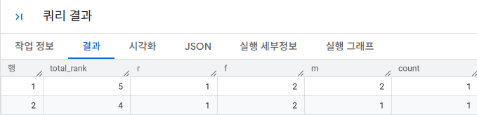
#### 1-7-4-2  종합 랭크(합산 점수)별 집계
```sql
WITH
purchase_log AS (
  SELECT
    user_id,
    amount,
    SUBSTR(stamp, 1, 10) AS dt
  FROM
    `sql-master-507514.3rd_week.action_log`
  WHERE
    action = 'purchase'
)
, user_rfm AS (
  SELECT
    user_id,
    MAX(dt) AS recent_date,
    DATE_DIFF(CURRENT_DATE(), DATE(TIMESTAMP(MAX(dt))), DAY) AS recency,
    COUNT(dt) AS frequency,
    SUM(amount) AS monetary
  FROM
    purchase_log
  GROUP BY
    user_id
)
, user_rfm_rank AS (
  SELECT
    user_id,
    CASE
      WHEN recency < 14 THEN 5
      WHEN recency < 28 THEN 4
      WHEN recency < 60 THEN 3
      WHEN recency < 90 THEN 2
      ELSE 1
    END AS r,
    CASE
      WHEN 20 <= frequency THEN 5
      WHEN 10 <= frequency THEN 4
      WHEN  5 <= frequency THEN 3
      WHEN  2 <= frequency THEN 2
      WHEN  1  = frequency THEN 1
    END AS f,
    CASE
      WHEN 300000 <= monetary THEN 5
      WHEN 100000 <= monetary THEN 4
      WHEN  30000 <= monetary THEN 3
      WHEN   5000 <= monetary THEN 2
      ELSE 1
    END AS m
  FROM
    user_rfm
)
SELECT
  r + f + m AS total_rank,
  COUNT(user_id) AS count
FROM
  user_rfm_rank
GROUP BY
  total_rank
ORDER BY
  total_rank DESC
;
```
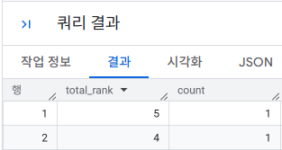

#### 1-7-5 2차원으로 사용자 인식하기

**핵심 원리 및 요약**
- RFM 지표를 사용하여 사용자 층을 정의합니다.
- R(Recency)와 F(Frequency)를 사용하여 2차원 사용자 층을 구성합니다.
- 각 셀에 사용자가 얼마나 있는지 집계합니다.
- 높은 랭크로 사용자를 이동시키려면 어떤 대책이 필요할지 검토합니다.

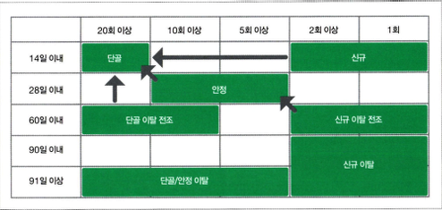

```sql
WITH
purchase_log AS (
  SELECT
    user_id,
    amount,
    SUBSTR(stamp, 1, 10) AS dt
  FROM
    `sql-master-507514.3rd_week.action_log`
  WHERE
    action = 'purchase'
)
, user_rfm AS (
  SELECT
    user_id,
    MAX(dt) AS recent_date,
    DATE_DIFF(CURRENT_DATE(), DATE(TIMESTAMP(MAX(dt))), DAY) AS recency,
    COUNT(dt) AS frequency,
    SUM(amount) AS monetary
  FROM
    purchase_log
  GROUP BY
    user_id
)
, user_rfm_rank AS (
  SELECT
    user_id,
    -- R (최근성) 랭크 부여
    CASE
      WHEN recency < 14 THEN 5
      WHEN recency < 28 THEN 4
      WHEN recency < 60 THEN 3
      WHEN recency < 90 THEN 2
      ELSE 1
    END AS r,

    -- F (빈도) 랭크 부여
    CASE
      WHEN 20 <= frequency THEN 5
      WHEN 10 <= frequency THEN 4
      WHEN  5 <= frequency THEN 3
      WHEN  2 <= frequency THEN 2
      WHEN  1  = frequency THEN 1
    END AS f,

    -- M (구매금액) 랭크 부여
    CASE
      WHEN 300000 <= monetary THEN 5
      WHEN 100000 <= monetary THEN 4
      WHEN  30000 <= monetary THEN 3
      WHEN   5000 <= monetary THEN 2
      ELSE 1
    END AS m
  FROM
    user_rfm
)
SELECT
  CONCAT('r_', CAST(r AS STRING)) AS r_rank,     -- R 점수를 'r_5', 'r_4' 형태의 문자열 행 라벨로 가공 (피벗 기준 행)
  COUNT(CASE WHEN f = 5 THEN 1 END) AS f_5,      -- R 점수 그룹 내에서 F(구매 빈도) 랭크가 5인 사용자 수 집계 (피벗 열 1)
  COUNT(CASE WHEN f = 4 THEN 1 END) AS f_4,      -- R 점수 그룹 내에서 F(구매 빈도) 랭크가 4인 사용자 수 집계 (피벗 열 2)
  COUNT(CASE WHEN f = 3 THEN 1 END) AS f_3,      -- R 점수 그룹 내에서 F(구매 빈도) 랭크가 3인 사용자 수 집계 (피벗 열 3)
  COUNT(CASE WHEN f = 2 THEN 1 END) AS f_2,      -- R 점수 그룹 내에서 F(구매 빈도) 랭크가 2인 사용자 수 집계 (피벗 열 4)
  COUNT(CASE WHEN f = 1 THEN 1 END) AS f_1       -- R 점수 그룹 내에서 F(구매 빈도) 랭크가 1인 사용자 수 집계 (피벗 열 5)

  -- 동작 원리: 세로로 긴 R(행)과 F(열)의 교차 데이터를 2차원 매트릭스 형태로 펼치는 조건부 집계 피벗(Conditional Aggregation Pivot) 기법입니다. CASE WHEN으로 해당 F 등급만 1로 남겨두고 나머지는 NULL로 처리한 뒤, COUNT() 함수가 NULL을 자동으로 집계에서 제외하는 특성을 활용해 등급별 인원수를 열(Column)로 전개합니다.

FROM
  user_rfm_rank
GROUP BY
  r
ORDER BY
  r_rank DESC
;
```
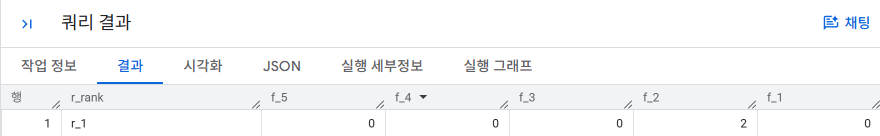

**결과 설명 / 주의점**
- `user_rfm_rank` CTE에서 사용자의 최근 구매일과 구매 횟수를 기반으로 R과 F의 랭크를 계산합니다.
- `rfm_rank` CTE에서 R과 F의 랭크를 문자열로 변환하여 2차원 사용자 층을 구성합니다.
- 최종 쿼리에서 각 2차원 사용자 층의 사용자 수를 집계하고, R과 F의 랭크를 기준으로 정렬합니다.
- 주의점: R과 F의 랭크는 사용자의 구매 행동에 따라 달라질 수 있으므로, 실제 분석에서는 적절한 랭크 계산 방법을 고려해야 합니다.
### 🎉 수고하셨습니다.
